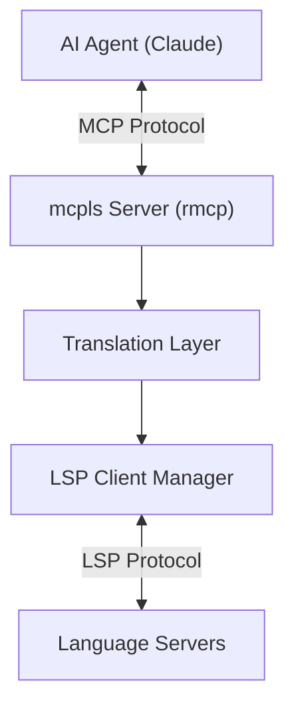

# Changelog

All notable changes to this project will be documented in this file.

The format is based on [Keep a Changelog](https://keepachangelog.com/en/1.1.0/),
and this project adheres to [Semantic Versioning](https://semver.org/spec/v2.0.0.html).

## [Unreleased]

## [0.1.0] - 2025-12-25

Initial release of mcpls - Universal MCP to LSP bridge enabling AI agents to access semantic code intelligence.

### Added

**Core Features**:
- Universal MCP to LSP bridge exposing semantic code intelligence to AI agents
- 8 MCP tools for code intelligence:
  - `get_hover` - Type information and documentation at cursor position
  - `get_definition` - Symbol definition location (go-to-definition)
  - `get_references` - Find all references to a symbol across workspace
  - `get_diagnostics` - Compiler errors, warnings, and hints
  - `rename_symbol` - Workspace-wide symbol renaming with preview
  - `get_completions` - Code completion suggestions with documentation
  - `get_document_symbols` - List all symbols in a document (outline view)
  - `format_document` - Code formatting according to language server rules
- LSP client implementation with JSON-RPC 2.0 transport over stdio
- Support for multiple concurrent language servers (one per language)
- Intelligent LSP server lifecycle management (spawn, initialize, shutdown)
- Position encoding conversion (MCP 1-based to LSP 0-based, UTF-8/UTF-16/UTF-32)
- Document state tracking with lazy loading and synchronization
- Path validation and workspace boundary security
- TOML configuration support with multiple discovery locations

**Language Support**:
- Built-in rust-analyzer support (zero-config for Rust projects)
- Configurable support for any LSP-compliant language server:
  - Python (pyright, pylsp)
  - TypeScript/JavaScript (typescript-language-server)
  - Go (gopls)
  - C/C++ (clangd)
  - Java (jdtls)
  - And any other LSP 3.17 compliant server

**CLI & Configuration**:
- `mcpls` binary with stdio transport for MCP protocol
- Configuration file support (`mcpls.toml`) with auto-discovery:
  - `--config` flag
  - `$MCPLS_CONFIG` environment variable
  - `./mcpls.toml` (current directory)
  - `~/.config/mcpls/mcpls.toml` (user config)
- Structured logging (JSON and human-readable formats)
- Log level control via `--log-level` and `$MCPLS_LOG`
- Environment variable support for all settings
- Workspace root auto-detection from current directory

**Testing Infrastructure**:
- 72+ unit and integration tests (100% pass rate)
- Mock LSP server for isolated unit testing
- Integration tests with real rust-analyzer
- End-to-end MCP protocol tests
- Test fixtures (Rust workspace, configuration files)
- cargo-nextest configuration for parallel test execution
- 51.32% code coverage baseline

**Documentation**:
- Comprehensive README with quick start guide
- User documentation:
  - Getting started guide with Claude Code integration
  - Configuration reference with examples
  - Tools reference (all 8 MCP tools documented)
  - Troubleshooting guide with common issues
- API documentation (rustdoc) for all public APIs
- Architecture Decision Records (7 ADRs):
  - ADR-001: Workspace structure
  - ADR-002: Error handling strategy
  - ADR-003: Async runtime selection
  - ADR-004: Position encoding conversion
  - ADR-005: Document state management
  - ADR-006: Configuration format
  - ADR-007: rmcp integration
- Example configurations for multiple languages

**Quality & CI/CD**:
- Comprehensive CI/CD pipeline with GitHub Actions
- Multi-platform testing (Linux, macOS, Windows)
- Security audit with cargo-deny (advisories, licenses, bans)
- Clippy linting (pedantic + nursery level warnings)
- rustfmt code formatting enforcement
- Documentation completeness checks
- Code coverage reporting with codecov
- MSRV enforcement (Rust 1.85, Edition 2024)
- Automated release workflow:
  - Binary builds for 5 platforms (Linux x86_64, Linux musl, macOS x86_64, macOS aarch64, Windows x86_64)
  - Automatic publishing to crates.io (mcpls-core first, then mcpls)
  - GitHub Releases with binary artifacts
  - Changelog integration

**Performance & Optimization**:
- Optimized release profile with LTO and code generation settings
- Binary size optimization (strip symbols, single codegen unit)
- Async-first design for concurrent LSP server management
- Efficient document synchronization (incremental updates)
- Lazy initialization of LSP servers
- Resource limits and timeouts

**Security**:
- Path validation for all file operations (workspace boundary checks)
- No `unsafe` code allowed (enforced by lints)
- Regular dependency audits (cargo-deny)
- License compliance verification (MIT OR Apache-2.0)
- Secure LSP server process spawning
- Input validation for all MCP tool parameters

**Developer Experience**:
- Workspace-based Cargo project (mcpls-core library, mcpls CLI)
- Comprehensive error messages with context
- Tracing-based logging with structured output
- Mock infrastructure for testing
- Clear contribution guidelines
- Issue and PR templates

### Changed

- N/A (initial release)

### Deprecated

- N/A (initial release)

### Removed

- N/A (initial release)

### Fixed

- N/A (initial release)

### Security

- Path validation prevents access outside workspace boundaries
- All LSP file operations validated against workspace roots
- Resource limits enforced for document tracking
- No unsafe code (enforced via workspace lints)
- Regular security audits via cargo-deny in CI
- Dependency vulnerability scanning on every commit

## Technical Details

**Architecture**:


**Dependencies**:
- rmcp 0.12 - Official MCP Rust SDK
- lsp-types 0.97 - LSP type definitions
- tokio 1.48 - Async runtime
- serde/serde_json 1.0 - Serialization
- clap 4.5 - CLI argument parsing
- tracing 0.1 - Structured logging

**Supported Platforms**:
- Linux x86_64 (glibc and musl)
- macOS x86_64 (Intel)
- macOS aarch64 (Apple Silicon)
- Windows x86_64

**Rust Version**:
- MSRV: 1.85
- Edition: 2024
- Stable Rust required

**Installation Methods**:
1. From crates.io: `cargo install mcpls`
2. From source: `cargo install --path crates/mcpls-cli`
3. Pre-built binaries from GitHub Releases

**Configuration Example**:
```toml
[[lsp_servers]]
language_id = "rust"
command = "rust-analyzer"
args = []
file_patterns = ["**/*.rs"]

[[lsp_servers]]
language_id = "python"
command = "pyright-langserver"
args = ["--stdio"]
file_patterns = ["**/*.py"]
```

**Usage with Claude Code**:
Add to `~/.claude/mcp.json`:
```json
{
  "mcpServers": {
    "mcpls": {
      "command": "mcpls",
      "args": []
    }
  }
}
```

## Known Limitations

- LSP servers must be installed separately (not bundled)
- Language server initialization can take 1-5 seconds on first use
- Limited to LSP 3.17 protocol features
- No support for LSP extensions (server-specific features)
- Document synchronization is full-text (not incremental at protocol level)

## Future Roadmap

**Phase 7** (Enhanced Features):
- Workspace symbol search across files
- Code actions (quick fixes, refactorings)
- Semantic tokens (syntax highlighting)
- Call hierarchy (incoming/outgoing calls)
- Type hierarchy
- Inlay hints

**Phase 8** (Performance & Scale):
- LSP server connection pooling
- Response caching
- Incremental document sync at protocol level
- Batch request optimization
- Memory usage optimization

**Phase 9** (Developer Experience):
- Configuration schema with validation
- Better error messages with recovery suggestions
- Progress reporting for long operations
- Workspace auto-discovery
- LSP server auto-detection and installation

[Unreleased]: https://github.com/bug-ops/mcpls/compare/v0.1.0...HEAD
[0.1.0]: https://github.com/bug-ops/mcpls/releases/tag/v0.1.0
