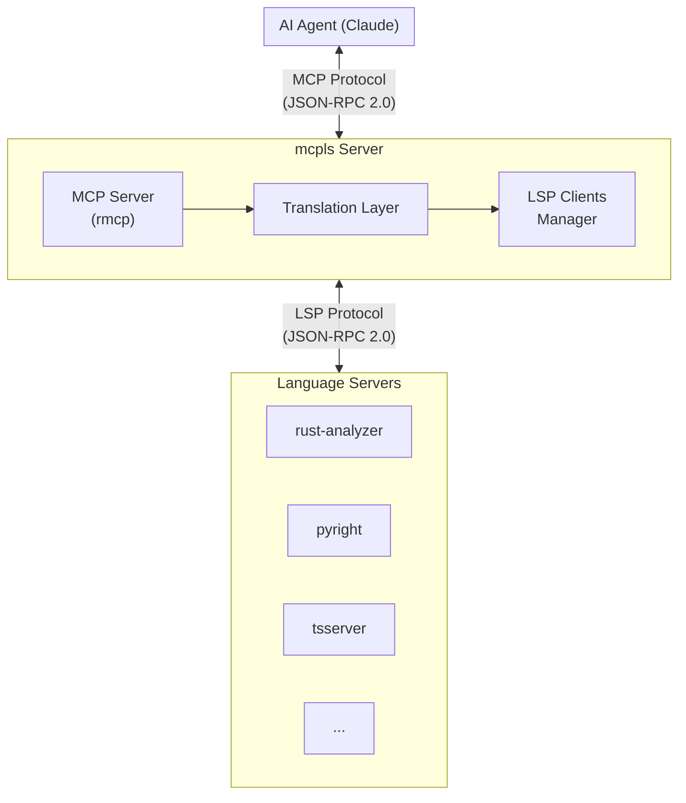

# mcpls

[](https://crates.io/crates/mcpls)
[](https://docs.rs/mcpls-core)
[](https://github.com/bug-ops/mcpls/actions)
[](https://codecov.io/gh/bug-ops/mcpls)
[](https://blog.rust-lang.org/2025/02/20/Rust-1.85.0.html)
[](LICENSE-MIT)

**Stop treating code as text. Give your AI agent a compiler's understanding.**

mcpls is a universal bridge between AI coding assistants and language servers. It exposes the full power of LSP — type inference, cross-reference analysis, semantic navigation — through the Model Context Protocol, enabling AI agents to reason about code the way IDEs do.

## Why mcpls?

AI coding assistants are remarkably capable, but they're working blind. They see code as text, not as the structured, typed, interconnected system it actually is. When Claude asks "what type is this variable?" it's guessing from context. When it refactors a function, it's hoping it found all the callers.

**mcpls changes that.** By bridging MCP and LSP, it gives AI agents access to:

- **Type information** — Know exactly what a variable is, not what it might be
- **Cross-references** — Find every usage of a symbol across your entire codebase
- **Semantic navigation** — Jump to definitions, implementations, type declarations
- **Real diagnostics** — See actual compiler errors, not hallucinated ones
- **Intelligent completions** — Get suggestions that respect scope and types
- **Safe refactoring** — Rename symbols with confidence, workspace-wide
- **Graceful degradation** — Use available language servers, even if some fail to initialize

> [!TIP]
> Zero configuration for Rust projects. Just install mcpls and a language server — ready to go.

## Prerequisites

> [!TIP]
> mcpls uses graceful degradation — if one language server fails or isn't installed, it continues with available servers. You don't need all servers installed.

For Rust projects, install rust-analyzer:

```bash
# Via rustup (recommended)
rustup component add rust-analyzer

# Or via Homebrew (macOS)
brew install rust-analyzer

# Or via package manager (Linux)
# Ubuntu/Debian: sudo apt install rust-analyzer
# Arch: sudo pacman -S rust-analyzer
```

> [!IMPORTANT]
> At least one language server must be available. Without any configured servers or if all fail to initialize, mcpls will return a clear error message.

## Installation

### From crates.io

```bash
cargo install mcpls
```

### Pre-built binaries

Download from [GitHub Releases](https://github.com/bug-ops/mcpls/releases/latest):

| Platform | Architecture | Download |
|----------|--------------|----------|
| Linux | x86_64 | [mcpls-linux-x86_64.tar.gz](https://github.com/bug-ops/mcpls/releases/latest) |
| Linux | x86_64 (static) | [mcpls-linux-x86_64-musl.tar.gz](https://github.com/bug-ops/mcpls/releases/latest) |
| macOS | Intel | [mcpls-macos-x86_64.tar.gz](https://github.com/bug-ops/mcpls/releases/latest) |
| macOS | Apple Silicon | [mcpls-macos-aarch64.tar.gz](https://github.com/bug-ops/mcpls/releases/latest) |
| Windows | x86_64 | [mcpls-windows-x86_64.zip](https://github.com/bug-ops/mcpls/releases/latest) |

### From source

```bash
git clone https://github.com/bug-ops/mcpls
cd mcpls
cargo install --path crates/mcpls-cli
```

## Quick Start

### 1. Configure Claude Code

Add mcpls to your MCP configuration (`~/.claude/claude_desktop_config.json`):

```json
{
  "mcpServers": {
    "mcpls": {
      "command": "mcpls",
      "args": []
    }
  }
}
```

### 2. Configure language servers (optional)

For languages beyond Rust, create a configuration file:

**Linux/macOS:**
```bash
mkdir -p ~/.config/mcpls
cat > ~/.config/mcpls/mcpls.toml << 'EOF'
[[lsp_servers]]
language_id = "python"
command = "pyright-langserver"
args = ["--stdio"]
file_patterns = ["**/*.py"]

[[lsp_servers]]
language_id = "typescript"
command = "typescript-language-server"
args = ["--stdio"]
file_patterns = ["**/*.ts", "**/*.tsx"]
EOF
```

**macOS (alternative XDG location):**
```bash
mkdir -p ~/Library/Application\ Support/mcpls
# Copy or create mcpls.toml in ~/Library/Application Support/mcpls/
```

> [!NOTE]
> macOS users: `dirs::config_dir()` returns `~/Library/Application Support/` by default. Use that path if `~/.config/mcpls/` doesn't work.

### 3. Experience the difference

```
You: What's the return type of process_request on line 47?

Claude: [get_hover] It returns Result<Response, ApiError> where:
        - Response is defined in src/types.rs:23
        - ApiError is an enum with variants: Network, Parse, Timeout

You: Find everywhere ApiError::Timeout is handled

Claude: [get_references] Found 4 matches:
        - src/handlers/api.rs:89 — retry logic
        - src/handlers/api.rs:156 — logging
        - src/middleware/timeout.rs:34 — wrapper
        - tests/api_tests.rs:201 — test case
```

## MCP Tools

### Code Intelligence

| Tool | What it does |
|------|--------------|
| `get_hover` | Type signatures, documentation, inferred types at any position |
| `get_definition` | Jump to where a symbol is defined — across files, across crates |
| `get_references` | Every usage of a symbol in your workspace |
| `get_completions` | Context-aware suggestions that respect types and scope |
| `get_document_symbols` | Structured outline — functions, types, constants, imports |
| `workspace_symbol_search` | Find symbols by name across the entire workspace |

### Diagnostics & Analysis

| Tool | What it does |
|------|--------------|
| `get_diagnostics` | Real compiler errors and warnings, not guesses |
| `get_cached_diagnostics` | Fast access to push-based diagnostics from LSP server |
| `get_code_actions` | Quick fixes, refactorings, and source actions at a position |

### Refactoring

| Tool | What it does |
|------|--------------|
| `rename_symbol` | Workspace-wide rename with full reference tracking |
| `format_document` | Apply language-specific formatting rules |

### Call Hierarchy

| Tool | What it does |
|------|--------------|
| `prepare_call_hierarchy` | Get callable items at a position for call hierarchy |
| `get_incoming_calls` | Find all callers of a function (who calls this?) |
| `get_outgoing_calls` | Find all callees of a function (what does this call?) |

### Server Monitoring

| Tool | What it does |
|------|--------------|
| `get_server_logs` | Debug LSP issues with internal log messages |
| `get_server_messages` | User-facing messages from the language server |

## Configuration

### Environment Variables

| Variable | Description | Default |
|----------|-------------|---------|
| `MCPLS_CONFIG` | Path to configuration file | Auto-detected |
| `MCPLS_LOG` | Log level (trace, debug, info, warn, error) | `info` |
| `MCPLS_LOG_JSON` | Output logs as JSON | `false` |

### Full Configuration Example

```toml
[workspace]
roots = ["/path/to/project"]
position_encodings = ["utf-8", "utf-16"]

[[lsp_servers]]
language_id = "rust"
command = "rust-analyzer"
args = []
file_patterns = ["**/*.rs"]
timeout_seconds = 30

[lsp_servers.initialization_options]
cargo.features = "all"
checkOnSave.command = "clippy"

[lsp_servers.env]
RUST_BACKTRACE = "1"
```

> [!NOTE]
> See [Configuration Reference](docs/user-guide/configuration.md) for all options.

## Supported Language Servers

mcpls works with any LSP 3.17 compliant server. Battle-tested with:

| Language | Server | Notes |
|----------|--------|-------|
| Rust | rust-analyzer | Zero-config, built-in support |
| Python | pyright | Full type inference |
| TypeScript/JS | typescript-language-server | JSX/TSX support |
| Go | gopls | Modules and workspaces |
| C/C++ | clangd | compile_commands.json |
| Java | jdtls | Maven/Gradle projects |

## Architecture



**Key design decisions:**

- **Single binary** — No Node.js, Python, or other runtime dependencies
- **Async-first** — Tokio-based, handles multiple LSP servers concurrently
- **Memory-safe** — Pure Rust, zero `unsafe` blocks
- **Resource-bounded** — Configurable limits on documents and file sizes

## Documentation

- [Getting Started](docs/user-guide/getting-started.md) — First-time setup
- [Configuration Reference](docs/user-guide/configuration.md) — All options explained
- [Tools Reference](docs/user-guide/tools-reference.md) — Deep dive into each tool
- [Troubleshooting](docs/user-guide/troubleshooting.md) — Common issues and solutions
- [Installation Guide](docs/user-guide/installation.md) — Platform-specific instructions

## Development

```bash
# Build
cargo build

# Test (uses nextest for speed)
cargo nextest run

# Run locally
cargo run -- --log-level debug
```

**Requirements:** Rust 1.85+ (Edition 2024)

## Contributing

Contributions welcome. See [CONTRIBUTING.md](CONTRIBUTING.md) for guidelines.

## License

Dual-licensed under [Apache 2.0](LICENSE-APACHE) or [MIT](LICENSE-MIT) at your option.

---

**mcpls** — Because AI deserves to understand code, not just read it.
