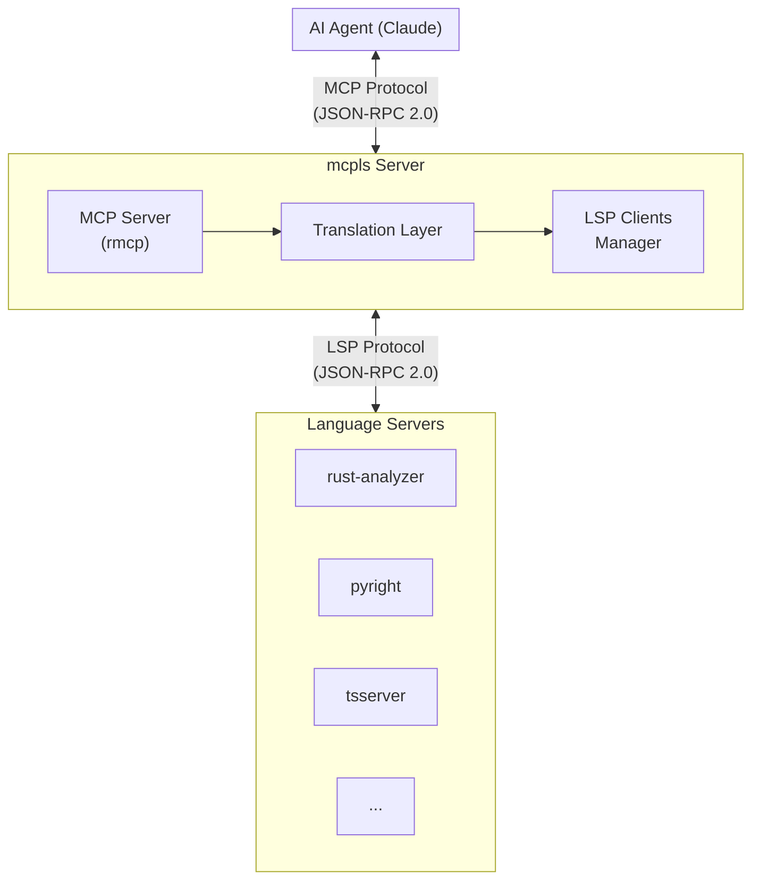

# mcpls

[](https://crates.io/crates/mcpls)
[](https://docs.rs/mcpls-core)
[](https://github.com/bug-ops/mcpls/actions)
[](https://codecov.io/gh/bug-ops/mcpls)
[](https://github.com/rust-lang/rust/releases/tag/1.99.0)
[](LICENSE-MIT)

**Stop treating code as text. Give your AI agent a compiler's understanding.**

mcpls is a universal bridge between AI coding assistants and language servers. It exposes the full power of LSP — type inference, cross-reference analysis, semantic navigation — through the Model Context Protocol, enabling AI agents to reason about code the way IDEs do.

## Why mcpls?

AI coding assistants are remarkably capable, but they're working blind. They see code as text, not as the structured, typed, interconnected system it actually is.

**mcpls changes that.** By bridging MCP and LSP, it gives AI agents access to:

- **Type information** — Know exactly what a variable is, not what it might be
- **Cross-references** — Find every usage of a symbol across your entire codebase
- **Semantic navigation** — Jump to definitions, implementations, type declarations
- **Real diagnostics** — See actual compiler errors, not hallucinated ones
- **Safe refactoring** — Rename symbols with confidence, workspace-wide

> [!TIP]
> Zero configuration for Rust projects. Just install mcpls and rust-analyzer — ready to go.

## Installation

**Linux / macOS:**

```bash
curl -fsSL https://raw.githubusercontent.com/bug-ops/mcpls/main/scripts/install.sh | sh
```

**Windows (PowerShell):**

```powershell
irm https://raw.githubusercontent.com/bug-ops/mcpls/main/scripts/install.ps1 | iex
```

Both scripts detect your OS/architecture, download the matching release archive, verify its SHA256 checksum, and install `mcpls` to a per-user directory (`~/.local/bin` on Linux/macOS, `$HOME\.local\bin` on Windows) — no `sudo`/admin rights required.

<details>
<summary><strong>Cargo, pre-built binaries & other methods</strong></summary>

**Cargo:**

```bash
cargo install mcpls
```

**Manual download:**

Download the archive matching your platform from [GitHub Releases](https://github.com/bug-ops/mcpls/releases/latest). Each archive has a corresponding `.sha256` checksum file published alongside it — the install scripts above verify this automatically; verify manually if downloading by hand.

| Platform | Architecture | Archive |
|----------|--------------|---------|
| Linux | x86_64 | `mcpls-x86_64-unknown-linux-gnu.tar.gz` |
| Linux | aarch64 | `mcpls-aarch64-unknown-linux-gnu.tar.gz` |
| macOS | Intel | `mcpls-x86_64-apple-darwin.tar.gz` |
| macOS | Apple Silicon | `mcpls-aarch64-apple-darwin.tar.gz` |
| Windows | x86_64 | `mcpls-x86_64-pc-windows-msvc.zip` |
| Windows | ARM64 | `mcpls-aarch64-pc-windows-msvc.zip` |

**From source:**

```bash
git clone https://github.com/bug-ops/mcpls
cd mcpls
cargo install --path crates/mcpls-cli
```

</details>

<details>
<summary><strong>Prerequisites (language servers)</strong></summary>

mcpls uses graceful degradation — if one language server fails, it continues with available servers.

**Rust (rust-analyzer):**
```bash
rustup component add rust-analyzer
# Or: brew install rust-analyzer (macOS)
```

**Python (pyright, built-in default):**
```bash
npm install -g pyright
```

**Python ([ty](https://docs.astral.sh/ty/), with custom configuration):**
```bash
uv tool install ty@latest
```

**TypeScript:**
```bash
npm install -g typescript-language-server typescript
```

**Go (gopls):**
```bash
go install golang.org/x/tools/gopls@latest
```

> [!IMPORTANT]
> At least one language server must be available.

</details>

## Quick Start

**1. Configure Claude Code** (`~/.claude/claude_desktop_config.json`):

```json
{
  "mcpServers": {
    "mcpls": {
      "command": "mcpls",
      "args": []
    }
  }
}
```

**2. Experience the difference:**

```
You: What's the return type of process_request on line 47?

Claude: [get_hover] It returns Result<Response, ApiError> where:
        - Response is defined in src/types.rs:23
        - ApiError is an enum with variants: Network, Parse, Timeout

You: Find everywhere ApiError::Timeout is handled

Claude: [get_references] Found 4 matches:
        - src/handlers/api.rs:89 — retry logic
        - src/handlers/api.rs:156 — logging
        - src/middleware/timeout.rs:34 — wrapper
        - tests/api_tests.rs:201 — test case
```

## MCP Tools

Names below are the defaults; if the bridge is configured with `mcp.tool_prefix`, every tool
name gains that prefix (`{tool_prefix}_{tool}`).

`get_diagnostics`, `get_definition`, `get_references`, and `get_document_symbols` also publish a
structured `outputSchema`, so MCP clients that support structured tool output get typed
`structuredContent` alongside the text response.

Position-based tools (`get_hover`, `get_definition`, `get_references`, `go_to_implementation`,
`go_to_type_definition`, `prepare_call_hierarchy`, `rename_symbol`) also accept a `symbol_name`
(optionally narrowed by `symbol_kind` and `container`) instead of `line`/`character`; see the
[tools reference](docs/user-guide/tools-reference.md#addressing-a-symbol-by-name).

<details>
<summary><strong>Code Intelligence</strong></summary>

| Tool | What it does |
|------|--------------|
| `get_hover` | Type signatures, documentation, inferred types at any position |
| `get_definition` | Jump to where a symbol is defined — across files, across crates (also accepts `context: "enclosing_symbol"`, like `go_to_implementation`, `go_to_type_definition` and `get_diagnostics`) |
| `get_references` | Every usage of a symbol in your workspace; opt in to the enclosing symbol of each hit with `context: "enclosing_symbol"` |
| `get_completions` | Context-aware suggestions that respect types and scope |
| `get_document_symbols` | Structured outline — functions, types, constants, imports |
| `workspace_symbol_search` | Find symbols by name across the entire workspace |
| `get_signature_help` | Parameter info and active signature while typing a call |
| `go_to_implementation` | Jump to implementations of a trait method or interface member |
| `go_to_type_definition` | Jump to the type definition of an expression, distinct from `get_definition` for variable bindings |
| `go_to_declaration` | Jump to the declaration of a symbol (C/C++ headers, interface members) |
| `get_inlay_hints` | Inferred type/parameter annotations an editor would render inline |
| `get_document_highlights` | Read, write and text occurrences of the symbol at a position within one file |

</details>

<details>
<summary><strong>Diagnostics & Analysis</strong></summary>

| Tool | What it does |
|------|--------------|
| `get_diagnostics` | Real compiler errors and warnings, not guesses |
| `get_cached_diagnostics` | Fast access to push-based diagnostics from LSP server |
| `get_code_actions` | Quick fixes, refactorings, and source actions at a position |

</details>

<details>
<summary><strong>Refactoring & Call Hierarchy</strong></summary>

| Tool | What it does |
|------|--------------|
| `rename_symbol` | Workspace-wide rename with full reference tracking |
| `prepare_rename` | Check whether a position can be renamed, and the range and placeholder, before `rename_symbol` |
| `format_document` | Apply language-specific formatting rules |
| `format_range` | Format only a range of a document |
| `prepare_call_hierarchy` | Get callable items at a position for call hierarchy |
| `get_incoming_calls` | Find all callers of a function (who calls this?) |
| `get_outgoing_calls` | Find all callees of a function (what does this call?) |
| `prepare_type_hierarchy` | Get type hierarchy items at a position |
| `get_supertypes` | Supertypes of a type hierarchy item |
| `get_subtypes` | Subtypes of a type hierarchy item |

</details>

<details>
<summary><strong>Server Monitoring</strong></summary>

| Tool | What it does |
|------|--------------|
| `get_server_logs` | Debug LSP issues with internal log messages |
| `get_server_messages` | User-facing messages from the language server |
| `get_tool_support` | Which tools are usable for which languages in this session, before calling them |
| `restart_server` | Restart a wedged or stale language server (kills its whole process group) without restarting mcpls |

</details>

## Configuration

<details>
<summary><strong>Server Heuristics</strong></summary>

mcpls uses smart heuristics to spawn only relevant language servers. Each server checks for project markers before starting.

| Language | Server | Project Markers |
|----------|--------|-----------------|
| Rust | rust-analyzer | `Cargo.toml`, `rust-toolchain.toml` |
| Python | pyright | `pyproject.toml`, `setup.py`, `requirements.txt` |
| TypeScript | typescript-language-server | `package.json`, `tsconfig.json` |
| Go | gopls | `go.mod`, `go.sum` |
| C/C++ | clangd | `CMakeLists.txt`, `compile_commands.json`, `Makefile` |
| Zig | zls | `build.zig`, `build.zig.zon` |

> [!TIP]
> Heuristics use OR logic — if ANY marker exists, the server spawns.

**Custom heuristics:**

```toml
[[lsp_servers]]
language_id = "rust"
command = "rust-analyzer"

[lsp_servers.heuristics]
project_markers = ["Cargo.toml", "rust-toolchain.toml", ".rust-version"]
```

</details>

<details>
<summary><strong>Environment Variables</strong></summary>

| Variable | Description | Default |
|----------|-------------|---------|
| `MCPLS_CONFIG` | Path to configuration file | Auto-detected |
| `MCPLS_TRUST_PROJECT_CONFIG` | Load a `./mcpls.toml` found in the current directory | `false` |
| `MCPLS_LOG` | Log level (trace, debug, info, warn, error, off) or `target=level` directives (a bare target such as `mcpls_core` is rejected, use `mcpls_core=trace`); unknown levels are rejected at startup | `info` |
| `MCPLS_LOG_JSON` | Output logs as JSON | `false` |

> [!NOTE]
> The two boolean flags above accept `1`/`0`, `true`/`false`, `yes`/`no`, `y`/`n`, and `on`/`off` (case-insensitive).

**Config file locations:**

| Platform | Default Location |
|----------|-----------------|
| Linux | `$XDG_CONFIG_HOME/mcpls/mcpls.toml`, else `~/.config/mcpls/mcpls.toml` |
| macOS | `~/Library/Application Support/mcpls/mcpls.toml` |
| Windows | `%APPDATA%\mcpls\mcpls.toml` |

> [!WARNING]
> A `./mcpls.toml` in the current directory is **not** loaded automatically: it
> can control which command mcpls spawns as an LSP server, so running mcpls
> against an untrusted checkout must not execute commands from that checkout
> without explicit consent. Pass `--trust-project-config` (or set
> `MCPLS_TRUST_PROJECT_CONFIG=true`) only for repositories you trust.

> [!WARNING]
> That flag does not make analyzing a workspace safe: language servers run
> workspace code (build scripts, procedural macros, tsserver plugins). By
> default mcpls pins the TypeScript server's `tsserver` to the one bundled with
> `typescript-language-server`, for `npm -g` style symlink installs (verified
> with Homebrew's node) with a global `typescript`. Windows `.cmd` shims, pnpm,
> Volta, asdf, mise and `npx`/`bunx` launchers are not covered (#604). See [SECURITY.md](SECURITY.md) for the trust model.

</details>

<details>
<summary><strong>Full Configuration Example</strong></summary>

```toml
[mcp]
title = "My Custom Bridge"
description = "Internal LSP bridge for Acme Corp"
instructions = "Use get_hover before get_definition."
tool_prefix = "optics"

[workspace]
roots = ["/path/to/project"]
heuristics_max_depth = 10
max_documents = 100    # 0 = unlimited
max_file_size = 10485760  # bytes, 0 = unlimited, max 1073741824 (1 GiB)
max_concurrent_server_starts = 8  # LSP servers starting at once, min 1

[[lsp_servers]]
language_id = "rust"
command = "rust-analyzer"
args = []
file_patterns = ["**/*.rs"]
timeout_seconds = 30
request_timeout_seconds = 30

[lsp_servers.heuristics]
project_markers = ["Cargo.toml", "rust-toolchain.toml"]

[lsp_servers.initialization_options]
cargo.features = "all"
checkOnSave.command = "clippy"

[[language_extensions]]
extensions = ["nu"]
language_id = "nushell"
```

> [!NOTE]
> `[mcp]` is entirely optional — omitting it (or any of its four fields)
> keeps mcpls's built-in `serverInfo`/`instructions` text unchanged. A
> configured `instructions` **replaces** the built-in capability blurb
> rather than appending to it.

See [Configuration Reference](docs/user-guide/configuration.md) for all options.

</details>

<details>
<summary><strong>HTTP Transport</strong></summary>

By default, mcpls communicates over stdin/stdout. You can expose it as an HTTP server using the `--listen` flag:

```bash
mcpls --listen 127.0.0.1:8080
```

> [!WARNING]
> mcpls performs **no authentication** on any transport, including HTTP. When binding to a non-loopback address (e.g., `0.0.0.0:8080`), you **must** place mcpls behind a reverse proxy that:
> - Enforces authentication before forwarding requests
> - Rewrites the `Host` header, or lists the names clients use with `--http-allowed-host` (the allowed `Host` values are `localhost`, `127.0.0.1`, `::1`, the bound IP address when it is a specific address, and the listed hosts; there is no wildcard)
> - Rewrites or strips the `Origin` header of browser clients, or lists their origins with `--http-allowed-origin` (a request carrying an `Origin` other than `localhost`, `127.0.0.1` or `[::1]` on the bound port, or a listed origin, is answered with `403`; requests without `Origin`, such as every non-browser client, are unaffected). `--http-allowed-origin` does not relax the `Host` check, which runs first

The HTTP service is mounted at the configured `HttpConfig::path` **and** at `/`, so reverse-proxy rules must cover both paths. `--http-path` (`MCPLS_HTTP_PATH`) must start with `/`, must not be `/`, and may contain only ASCII letters, digits and `-._~` in each segment; an invalid value exits with a usage error (exit code 2) before any language server starts, even without `--listen`.

mcpls serves HTTP/1 only and bounds slow or vanished clients with the limits below, all configurable through `HttpConfig` when embedding `mcpls-core`:

- `HeaderReadTimeout` (default 30 s) bounds the request head, a pause between request-body chunks (answered with `408 Request Timeout`) and idle keep-alive connections. It does not bound a client that stops reading a response, such as an SSE stream; the liveness probe below covers that.
- `WriteStallTimeout` (default 30 s, `HttpConfig::with_write_stall_timeout`) closes a connection whose write to the peer makes no progress, which frees the connection permit of a peer that stopped reading a response; its session slot is freed after the idle timeout. A peer that drains one send buffer per window is not detected. A connection that closes cleanly first discards the unread request body for at most 2 s of silence, 1 MiB or 30 s in total (none while the server shuts down), so an early `403` or `413` reaches a client that is still sending a smaller body.
- `ConnectionLimit` (default 512) caps concurrent connections. On macOS, launchd's default soft file-descriptor limit is 256, so raise it with `ulimit -n` (at least 600) before serving more than ~250 connections; library users can lower the cap with `HttpConfig::with_max_concurrent_connections`.
- `StreamLiveness` (default: probe every 60 s, answer within 30 s) pings each session's standalone GET (SSE) stream with an MCP `ping` request and closes it when the client stops answering, so a vanished peer (sleeping laptop, dropped NAT mapping) no longer holds its stream until the OS gives up. It runs inside mcpls, so it also works behind a reverse proxy. A client that never answers server `ping` requests would be disconnected every 90 s: pass `--http-stream-liveness off` (or `MCPLS_HTTP_STREAM_LIVENESS=off`), or `HttpConfig::with_stream_liveness(StreamLiveness::Disabled)` when embedding. With probing on, a client that answers probes on an open GET stream keeps its session indefinitely (#573). With probing off an open GET stream does not hold its session: the session expires after 5 minutes without an inbound request even while the stream receives notifications, so such clients must send a request (for example `ping`) more often than that. A POST or request-wise resume response stream is cut after `ResponseStreamDeadline` (default 1 hour, `HttpConfig::with_response_stream_deadline`) whatever it is still sending (a stream lifetime bound), which lets its session expire; a peer that stopped reading a response loses its connection after the write-stall timeout. The probe is the portable complement to the kernel-level `TCP_USER_TIMEOUT` (60 s) that mcpls sets on accepted sockets on Linux and Android (#552), which does not see through a reverse proxy. Stateless `subscriptions/listen` streams cannot be pinged, so they instead end abruptly after a jittered 15 to 30 minutes and well-behaved clients re-listen; `off` disables this lease too.

Authentication is never provided in-process, so the reverse proxy remains required.

**Example (nginx):**
```nginx
location / {
    auth_request /auth;
    proxy_pass http://localhost:8080;
    proxy_set_header Host localhost;
}
```

</details>

## Process Lifetime

When mcpls exits for any reason, including `SIGKILL` and OOM kills, LSP servers and the descendants that stay in their process tree are killed. This includes processes that are meant to outlive their server, such as shared build daemons. Caveats:

- **Unix:** each server has its own lifeline: a small anchor process leads its process group and a watchdog sits outside it. When mcpls exits, or the server is shut down or restarted, the watchdog freezes the tree, finds descendants that left the group with `setsid()` or `setpgid()` (for example the `cargo check` that rust-analyzer's flycheck runs) and kills everything, including shared daemons such as Gradle or Bloop that the server started. A crashed server's leftover processes are killed when the crash is noticed. This needs `ps` and `awk`; without `ps` a warning is logged and escaped descendants survive.
- **Unix:** descendants whose parent exited before the sweep (reparented to init) cannot be attributed and may survive, and a `pkill -9` that matches `lsp-lifeline-watchdog` kills the watchdog and prevents the sweep. Servers that exit only on stdin EOF wait out the 3 s shutdown grace and are then killed, and `processId` is sent as `null` in `initialize`.
- **Unix:** servers run in their own process group, so Ctrl-C in the terminal no longer reaches them directly. A descendant that reads `/dev/tty` (for example an ssh or git credential prompt) while mcpls runs in an interactive terminal may be stopped by `SIGTTIN`.
- **Unix:** if the anchor cannot be started, the server runs unbound in its own process group; if only the watchdog fails, the group is killed from mcpls on exit but escaped descendants are not swept. Ctrl-C does not reach servers in either case.
- **Windows:** servers run in a job object without breakaway, and the whole tree is killed. A descendant that requests `CREATE_BREAKAWAY_FROM_JOB` fails to spawn. If the job cannot be created or assigned, the server spawn fails.

## Supported Language Servers

mcpls works with any LSP 3.17 compliant server. Battle-tested with:

<details>
<summary><strong>View supported servers</strong></summary>

| Language | Server | Notes |
|----------|--------|-------|
| Rust | rust-analyzer | Zero-config, built-in support |
| Python | pyright (default), ty | Full type inference |
| TypeScript/JS | typescript-language-server | JSX/TSX support |
| Go | gopls | Modules and workspaces |
| C/C++ | clangd | compile_commands.json |
| Java | jdtls | Maven/Gradle projects |
| Zig | zls | build.zig support |
| And 24+ others | Any LSP 3.17 server | See [docs](docs/user-guide/configuration.md) |

</details>

## Architecture

<details>
<summary><strong>View architecture diagram</strong></summary>


```mermaid
flowchart TB
    subgraph AI["AI Agent (Claude)"]
    end

    subgraph mcpls["mcpls Server"]
        MCP["MCP Server<br/>(rmcp)"]
        Trans["Translation Layer"]
        LSP["LSP Clients<br/>Manager"]
        MCP --> Trans --> LSP
    end

    subgraph Servers["Language Servers"]
        RA["rust-analyzer"]
        PY["pyright"]
        TS["tsserver"]
        Other["..."]
    end

    AI <-->|"MCP Protocol<br/>(JSON-RPC 2.0)"| mcpls
    mcpls <-->|"LSP Protocol<br/>(JSON-RPC 2.0)"| Servers
```

**Key design decisions:**
- **Single binary** — No Node.js, Python, or other runtime dependencies
- **Async-first** — Tokio-based, handles multiple LSP servers concurrently
- **Memory-safe** — Pure Rust, zero `unsafe` blocks
- **Resource-bounded** — Configurable limits on documents and file sizes

</details>

## Documentation

- [Getting Started](docs/user-guide/getting-started.md)
- [Configuration Reference](docs/user-guide/configuration.md)
- [Tools Reference](docs/user-guide/tools-reference.md)
- [Troubleshooting](docs/user-guide/troubleshooting.md)
- [Agent Skill](skills/mcpls/) — packaged [Agent Skill](https://agentskills.io/specification) teaching an AI coding agent to install, configure, and run the mcpls CLI

## Development

```bash
cargo build              # Build
cargo nextest run        # Test
cargo run -- --log-level debug  # Run locally
```

**Requirements:** Rust 1.99+ (Edition 2024)

## Contributing

Contributions welcome. See [CONTRIBUTING.md](CONTRIBUTING.md) for guidelines.

## License

Dual-licensed under [Apache 2.0](LICENSE-APACHE) or [MIT](LICENSE-MIT) at your option.

---

**mcpls** — Because AI deserves to understand code, not just read it.
