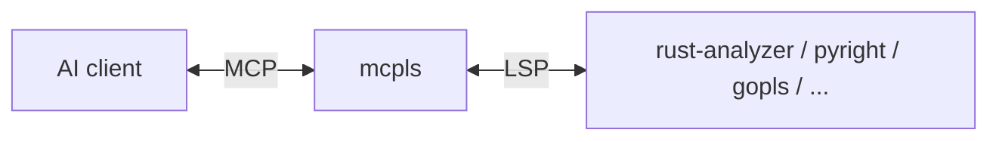

# mcpls

[](https://crates.io/crates/mcpls)
[](https://docs.rs/mcpls-core)
[](https://github.com/bug-ops/mcpls/actions)
[](https://codecov.io/gh/bug-ops/mcpls)
[](https://github.com/rust-lang/rust/releases/tag/1.99.0)
[](LICENSE-MIT)

**Give your AI coding agent a compiler's understanding of your code.**

mcpls is a bridge between the Model Context Protocol (MCP) and the Language Server Protocol (LSP). It runs the language servers for your project (rust-analyzer, pyright, gopls, and others) and exposes their type information, references, diagnostics and refactoring as 31 MCP tools, so an AI client reasons about code the way an IDE does.


```mermaid
flowchart LR
    C["AI client"] <-->|MCP| M["mcpls"] <-->|LSP| S["rust-analyzer / pyright / gopls / ..."]
```

## Documentation

The full documentation is the mcpls book: **<https://bug-ops.github.io/mcpls/>**

| Topic | Chapter |
|-------|---------|
| Install and first run | [Installation](https://bug-ops.github.io/mcpls/getting-started/installation.html) |
| Connect Claude Code or another client | [Connect an AI Client](https://bug-ops.github.io/mcpls/getting-started/connect-client.html) |
| Configure language servers | [Configuration](https://bug-ops.github.io/mcpls/guide/configuration.html) |
| All 31 tools | [Tools Overview](https://bug-ops.github.io/mcpls/tools/overview.html) |
| Something does not work | [Troubleshooting](https://bug-ops.github.io/mcpls/guide/troubleshooting.html) |
| HTTP transport and allowlists | [Transports](https://bug-ops.github.io/mcpls/advanced/transports.html) |
| Security model and untrusted workspaces | [Security and Trust](https://bug-ops.github.io/mcpls/advanced/security.html) |
| Every flag and config key | [Reference](https://bug-ops.github.io/mcpls/reference/cli.html) |

## Installation

**Linux and macOS:**

```bash
curl -fsSL https://raw.githubusercontent.com/bug-ops/mcpls/main/scripts/install.sh | sh
```

**Windows (PowerShell):**

```powershell
irm https://raw.githubusercontent.com/bug-ops/mcpls/main/scripts/install.ps1 | iex
```

Or with Cargo:

```bash
cargo install mcpls
```

You also need at least one language server, for example `rustup component add rust-analyzer`. See [Installation](https://bug-ops.github.io/mcpls/getting-started/installation.html) for other methods and servers.

## Quick start

Register mcpls with Claude Code:

```bash
claude mcp add --scope user mcpls -- mcpls
```

Then ask about your code:

```text
You:    What is the return type of process_request?
Claude: [get_hover] It returns Result<Response, ApiError>.

You:    Find everywhere ApiError::Timeout is handled.
Claude: [get_references] Found 4 matches: src/handlers/api.rs:89, ...
```

Rust projects need no configuration. Other languages and clients are covered in the [book](https://bug-ops.github.io/mcpls/getting-started/minimal-config.html).

## Features

- **Type information and documentation** at any position
- **Cross-references, definitions, implementations** across the whole workspace
- **Real diagnostics** from the compiler, not guesses
- **Rename and code-action edits** returned for the client to apply
- **Call and type hierarchies**, symbol search, formatting, inlay hints, selection and folding ranges
- **Address code by symbol name** as well as by position, and restart language servers on demand
- **Several language servers at once**, started concurrently and stopped with mcpls, with graceful degradation when one fails
- **stdio by default**, optional HTTP transport with Host and Origin allowlists and resource subscriptions
- **Untrusted-workspace mode** for analyzing code you do not trust
- **Single Rust binary**, no runtime dependencies, no `unsafe` code

## Security

Language servers run code that comes with the workspace, and mcpls does not sandbox them. Read [SECURITY.md](SECURITY.md) and the [Security and Trust](https://bug-ops.github.io/mcpls/advanced/security.html) chapter before pointing mcpls at code you did not write.

## Agent skill

[`skills/mcpls`](skills/mcpls/) is a packaged [Agent Skill](https://agentskills.io/specification) that teaches an AI coding agent to install, configure and run mcpls.

## Development

```bash
cargo build
cargo nextest run --workspace --all-features
```

Requires Rust 1.99 or later (edition 2024). The book lives in [`book/`](book/) and is built with [mdBook](https://rust-lang.github.io/mdBook/). See [CONTRIBUTING.md](CONTRIBUTING.md).

## Community

Participation is governed by the [Code of Conduct](CODE_OF_CONDUCT.md). Accessibility of the output and documentation is described in [ACCESSIBILITY.md](ACCESSIBILITY.md).

## License

Dual-licensed under [Apache 2.0](LICENSE-APACHE) or [MIT](LICENSE-MIT) at your option.
