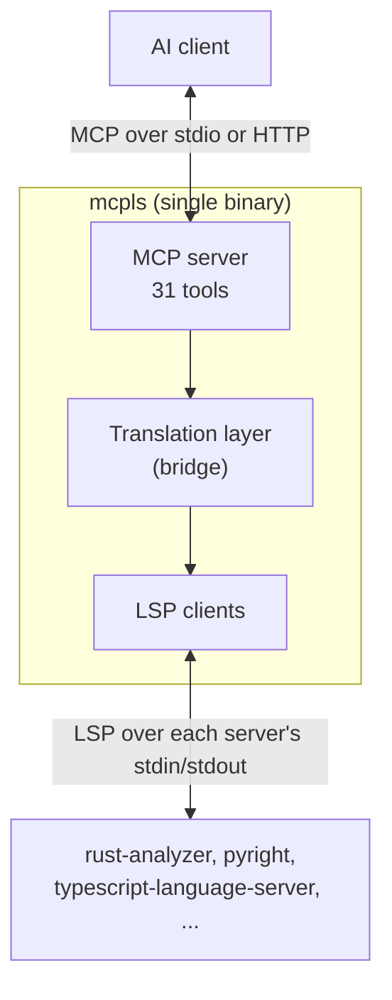
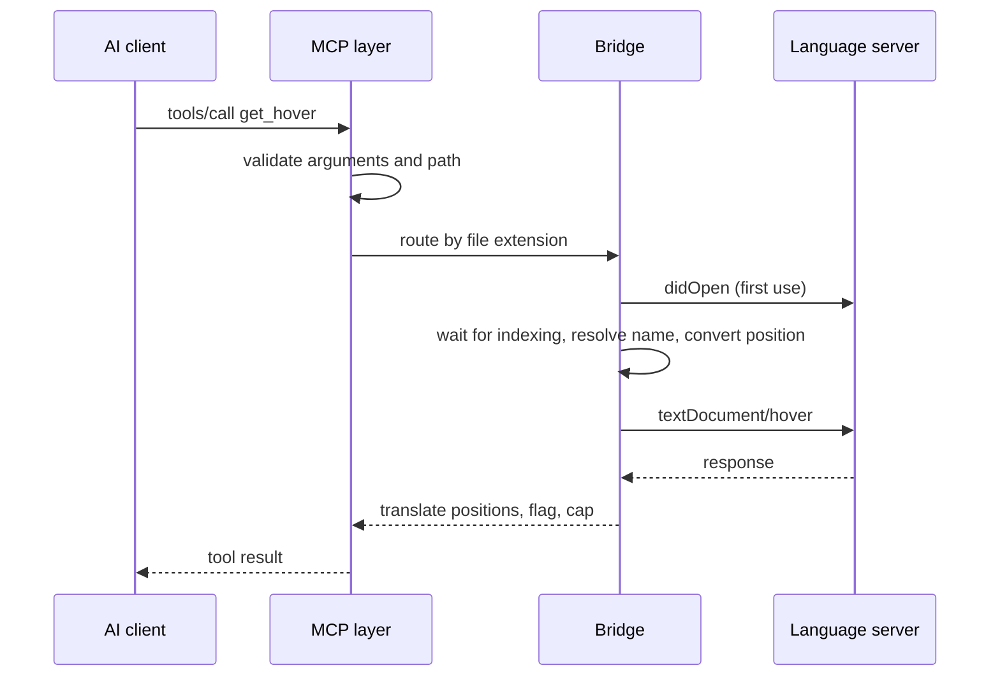

# Architecture

In this chapter you learn how mcpls is built and how one tool call travels from the AI client to a language server and back. Knowing the pieces explains the behavior you see in configuration, errors and timing.

## Prerequisites

- You have used mcpls from a client ([Part 1](../getting-started/installation.md)).

## The big picture

mcpls is a single Rust binary with no runtime dependencies. It is asynchronous (Tokio), runs several language servers concurrently, and forbids `unsafe` code across the workspace.

## Crates and modules

The workspace has two crates that matter to users:

| Crate | Role |
|-------|------|
| `mcpls` (`mcpls-cli`) | The binary: command-line parsing, logging, then a call into the library |
| `mcpls-core` | The library that implements everything else |

Inside `mcpls-core`:

| Module | Responsibility |
|--------|----------------|
| `config` | Loads TOML, discovers servers by project markers, holds the trust types |
| `lsp` | Spawns language servers and speaks JSON-RPC 2.0 to them; resolves which executable runs; pins `tsserver` |
| `mcp` | The MCP server (built on the `rmcp` crate): tool definitions and dispatch |
| `runtime` | Startup, supervision, shutdown, and the untrusted-workspace plan |
| `transport` | stdio and HTTP serving |
| `bridge` | The translation layer: positions, document state, diagnostics cache, routing |

## Life of a tool call

Follow `get_hover` with a symbol name:

1. **Validate.** The MCP layer checks the arguments and that `file_path` is under a workspace root.
2. **Route.** The router picks the language server for the file from its extension, honoring `handles` and falling back to a catch-all server if the preferred one failed to start.
3. **Open the document.** The bridge sends `textDocument/didOpen` the first time a file is touched, and re-syncs it if the file changed on disk.
4. **Wait for readiness.** For whole-workspace queries, mcpls waits (up to `indexing_ready_timeout_seconds`) until the server reports it has finished indexing.
5. **Resolve the name.** A `symbol_name` is resolved through `textDocument/documentSymbol`, and the identifier position is verified in the text.
6. **Convert the position.** 1-based MCP coordinates become 0-based LSP coordinates in the encoding the server negotiated ([Positions and Encodings](positions.md)).
7. **Request.** The LSP request is sent, bounded by `request_timeout_seconds`, and retried on "content modified".
8. **Translate back.** The response becomes the tool result: positions are converted back, locations are flagged `out_of_workspace` when outside the roots, and lists are capped.

## Design decisions

- **Graceful degradation.** Language servers start in the background and concurrently. The MCP handshake finishes without waiting for them, a slow server delays only its own languages, and a failed server never affects the others.
- **Lazy document state.** Files are opened in the server on first use and closed in least-recently-used order beyond `max_documents`, which bounds memory.
- **Poll-friendly diagnostics.** LSP pushes diagnostics; MCP clients ask for them. mcpls caches pushes and stores pull results so both views agree ([Diagnostics and Resources](diagnostics.md)).
- **Honest results.** Where information is lost, results say so (`positions_degraded`, `truncated`, `availability`, `dropped`) rather than looking complete.
- **Safe by default.** Workspace configuration is not trusted, environments are cleared, and executables are resolved explicitly ([Security and Trust](security.md)).

## What's Next

The next chapter explains the position conversion in step 6, the source of most subtle bugs in code bridges: [Positions and Encodings](positions.md).
