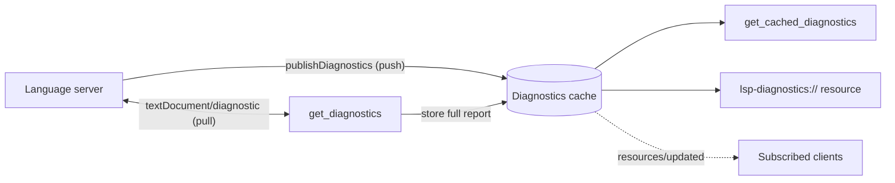

# Diagnostics and Resources

In this chapter you learn how mcpls reconciles two opposite diagnostic models, and how a client can subscribe to diagnostics instead of polling for them. This is the part to read when you build a client or need to know exactly when diagnostics change.

## Prerequisites

- You have used [`get_diagnostics`](../tools/diagnostics.md).

## Push versus pull

LSP servers deliver diagnostics in two ways:

- **Push.** The server sends `textDocument/publishDiagnostics` whenever it has new results. Background analyzers such as rust-analyzer's flycheck (clippy) work only this way.
- **Pull.** The client sends `textDocument/diagnostic` and receives a report.

MCP is request and response: an assistant asks for diagnostics when it needs them. mcpls bridges the gap with a bounded cache.

## The cache



- Every push is stored per file, keyed by the file's canonical path. A server may publish one file under several spellings (a symlink and its target); mcpls returns the union with exact duplicates removed.
- A full pull report from `get_diagnostics` is stored next to the pushed entries in a separate slot. Partial and `unchanged` reports, failed pulls, and reports that raced a later pull or an edit are returned to the caller but not stored.
- The cache holds at most 1000 file entries. When a write evicts another file, that file becomes `evicted`, which is reported honestly instead of as clean.
- Server log messages (100 entries) and `showMessage` messages (50 entries) are kept in separate bounded buffers for `get_server_logs` and `get_server_messages`.

`get_diagnostics` merges the pull answer with the cached pushes, deduplicating by severity, code and proximity. `get_cached_diagnostics` returns the cache alone and never triggers analysis. A file that is edited on disk keeps its last known diagnostics until the server publishes new ones or the next pull replaces them; there is no window where they appear empty.

## Availability

Every diagnostics answer carries `availability`, because an empty list is ambiguous:

| Value | Meaning |
|-------|---------|
| `published` | The server reported on the file; an empty list means clean |
| `pending` | Nothing has been published since the server started; unknown |
| `evicted` | A publish was dropped to bound the cache or the delivery buffer (a burst of more than 1000 files, or 64 MiB, from one server); what the server said is unknown |

A server restart returns every file to `pending`.

## Diagnostics as MCP resources

Each file's diagnostics are also available as an MCP resource:

```text
lsp-diagnostics:///work/app/src/main.rs
```

The URI uses an empty authority and the absolute path, percent-encoded. Reading it returns JSON with the same fields as `get_cached_diagnostics`:

| Field | Meaning |
|-------|---------|
| `tracked` | `false` (always with an empty list) when mcpls knows nothing about the file |
| `version` | The document version the diagnostics were computed against, when known |
| `diagnostics` | The LSP `Diagnostic` objects, with LSP's own casing |
| `availability` | As above |
| `indexing_in_progress`, `push_notifications_degraded` | As for `get_diagnostics` |

`resources/list` lists the currently open documents, 100 per page. A server that is still starting, or that failed to start, makes a read fail with the same errors as `get_cached_diagnostics` instead of returning an empty list.

### Subscriptions

mcpls supports `resources/subscribe`. A subscribed session receives `resources/updated`:

- once per accepted publish from the language server;
- when a `get_diagnostics` pull changes the merged view of the file, before that call returns (an identical pull sends nothing);
- when a write evicts the file from the cache, so a re-read returns its new `availability`.

If the file's server is still starting, subscribing succeeds, and the subscriber receives one `resources/updated` if startup then fails. A session may hold at most 1000 subscriptions.

Over HTTP, stateless `subscriptions/listen` streams carry the same updates. They have no session and cannot answer a server `ping`, so they are bounded by a lease: after a random 15 to 30 minutes the response ends without a final result, and a well-behaved client listens again. mcpls replays the cached diagnostics URIs plus any eviction in the last two minutes (at most 256), so nothing is lost across the gap. There can be at most 100 concurrent listen streams. See [Transports](transports.md#liveness-and-leases).

## Redaction

Text that comes from a language server is scrubbed of secrets before it reaches logs or clients. mcpls hides the values of secret-named environment variables, secret-named `--flag=value` arguments and secret-keyed `initialization_options` strings, where the name contains `TOKEN`, `KEY`, `SECRET`, `PASSW`, `CRED` or `AUTH` (case-insensitive) and the value is at least 8 bytes. Replacements read `[redacted:NAME]`.

This covers server log and show messages, startup and request errors, diagnostics (message, `source`, string `code`, related information and string values of `data`), `$/progress` text, trace-level wire logs and the spawn argument list. It does not cover URIs, the keys of a diagnostic's `data`, or tool results such as hover text and symbol names. Matching is by exact value plus its JSON-escaped and debug-escaped spellings, so a server that re-encodes a secret (as `\uXXXX`, `\/`, URL or base64 text) can slip past it in trace-level wire logs.

## What's Next

Next, see how mcpls is served to clients, over stdio or HTTP: [Transports](transports.md).
