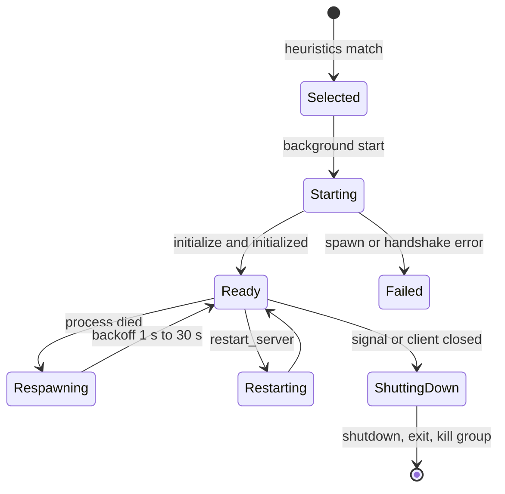

# Language Server Lifecycle

In this chapter you follow a language server from selection to shutdown: how mcpls decides which servers to start, what the LSP handshake does, what happens when a server is slow or dies, and how shutdown works. This explains why a first query can wait and why a crashed server comes back on its own.

## Prerequisites

- You know what a language server is ([Introduction](../introduction.md)).

## 1. Selection

At startup mcpls takes the configured `[[lsp_servers]]` entries and keeps those that apply to the workspace: an entry applies when it has no `heuristics`, or when any of its `project_markers` exists in the workspace tree. The search is recursive up to `workspace.heuristics_max_depth` levels (default 10, at most 64) and skips well-known directories such as `node_modules`, `target` and `.git`.

The remaining entries are checked for routing conflicts, and the config is refused if two applicable servers claim the same language identity or tool ([`handles`](../reference/config.md#handles)).

## 2. Concurrent start

Servers start in a background task. The MCP handshake with your client completes immediately, without waiting for any language server. At most `workspace.max_concurrent_server_starts` (default 8) start at once, and each server becomes usable as soon as its own `initialize` completes, in whatever order that happens.

A tool call for a language whose server has not registered yet returns the retryable `ServerInitializing` error (`-32051`). If the server failed to start, calls return `ServerFailedToStart` with the command and the reason.

## 3. The LSP handshake

For each server mcpls:

1. Spawns the process with a cleared environment plus an allowlist of variables and the entry's `env` ([Security and Trust](security.md)).
2. Sends `initialize` with the workspace folders, the position encodings it prefers, and the `initialization_options` from the entry. The request is bounded by `timeout_seconds` (default 30, at most 900).
3. Reads the server's capabilities from the reply. Tool support is derived from these.
4. Sends `initialized`, and then the entry's `settings` with `workspace/didChangeConfiguration`.

## 4. Steady state

- **Documents.** `textDocument/didOpen` is sent on first use of a file. Beyond `workspace.max_documents`, the least recently used unlocked document is closed with `didClose`. Edits on disk are detected on the next call and the server is resynchronized.
- **Requests.** Each is bounded by `request_timeout_seconds`. A "content modified" answer (`-32802`) is retried with exponential backoff, up to 4 attempts. Completions are capped at 10 seconds.
- **Indexing readiness.** mcpls watches the server's readiness signals (rust-analyzer's `experimental/serverStatus`, or generic `$/progress`). Whole-workspace queries wait for a server that is still indexing, up to `indexing_ready_timeout_seconds`, and then fail with a "still indexing" error instead of answering from a partial index. A server that never reports a signal is never delayed, and `indexing = "disabled"` opts a server out.
- **Notifications.** Diagnostics, log messages and `showMessage` notifications are cached for the tools that read them ([Diagnostics and Resources](diagnostics.md)).

## 5. Failure and recovery

If a server process dies, the next call that needs it respawns it, with a backoff that grows from 1 second up to 30 seconds. Documents are reopened on the new process, and the call is gated on the new server's readiness. After a crash, push-only diagnostics are lost, so results carry `push_notifications_degraded: true`.

`restart_server` does the same on demand. It has a 5 second cooldown per server, and requests in flight on the old process fail with the retryable `-32054`.

## 6. Shutdown

On `SIGTERM`, `SIGINT`, or when the client closes the connection, mcpls shuts down gracefully:

1. It stops accepting work and cancels background tasks.
2. For each server it sends the LSP `shutdown` request (5 second timeout), then `exit`.
3. It waits a short grace period (3 seconds) for the process to leave, then kills it together with its process group ([Process Lifetime](process-lifetime.md)).

A second signal while cleanup is stuck forces an immediate exit. The exit code is `0` on success, `1` on an error and `101` if mcpls itself panicked, in which case the servers are still reaped.

## What's Next

Next, see how diagnostics flow through the cache and reach clients as resources: [Diagnostics and Resources](diagnostics.md).
