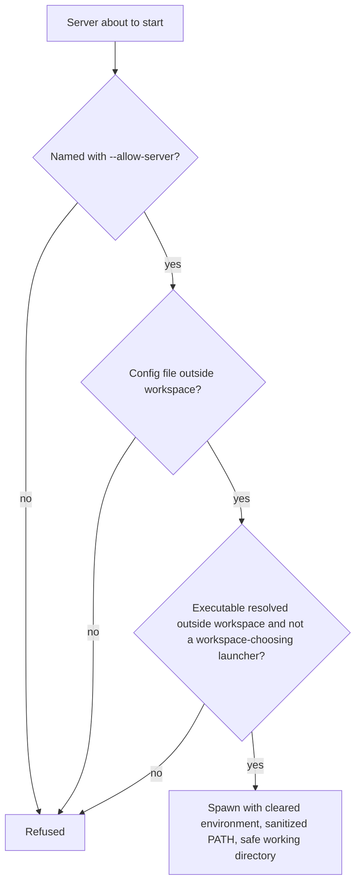

# Untrusted-Workspace Mode

In this chapter you learn how to run mcpls against code you do not trust: which servers start, what is checked before each launch, and what the mode does not cover. It reduces how much of the workspace can steer which program runs. It is not a sandbox.

## Prerequisites

- You have read [Security and Trust](security.md).

## Turn it on

Untrusted mode is selected only on the command line:

```bash
mcpls --workspace-trust untrusted --allow-server rust --allow-server python
```

- `--workspace-trust` is `trusted` (the default) or `untrusted`.
- `--allow-server <id>` names a server to start. Repeat it for each server. The id is the server's `name`, otherwise its `language_id`. An id that matches no configured server is rejected at startup.

In a client configuration:

```json
{
  "mcpServers": {
    "mcpls": {
      "command": "mcpls",
      "args": ["--workspace-trust", "untrusted", "--allow-server", "rust"]
    }
  }
}
```

Neither flag has an environment variable or a configuration key, so a file planted in the workspace cannot grant consent. The mode conflicts with `--trust-project-config`, and `--allow-server` without it is a usage error (exit code 2).

> **Important:** Put the mode in your user-scoped client configuration. A project-scoped file, such as a `.mcp.json` in the analyzed repository, is controlled by the repository and can drop the flag.

## What it enforces



Every applicable server that is not allowed is refused before it can spawn, restart or respawn. A tool call routed to it returns an error naming the server and the flag that would start it.

For the servers you allow, mcpls also checks:

| Check | Rule |
|-------|------|
| Configuration file | The file that was loaded (`--config`, `MCPLS_CONFIG`, or the user config) must lie outside the workspace. No default config file is created in this mode |
| Executable | It is resolved the way a spawn finds it, must exist outside every workspace root, and is launched by its resolved absolute path, also on restart and respawn |
| `PATH` | The server gets a `PATH` with workspace, relative and empty entries removed, so an interpreter such as `node` cannot resolve into the workspace |
| Environment | Cleared, then the allowlist. `NODE_OPTIONS`, `LD_PRELOAD`, `DYLD_INSERT_LIBRARIES`, `PYTHONPATH`, `RUSTC_WRAPPER` and `XDG_CONFIG_HOME` are not passed unless the server's own `env` sets them. `HOME` and `USERPROFILE` are replaced by your login home directory from the account database |
| Launcher | A `command` that lets the workspace choose the program is refused: package runners (`npm`, `npx`, `bunx`, `pnpm`, `pnpx`, `yarn`, `uvx`, `corepack`, `deno npm:`), task runners (`make`, `just`, `task`, `rake`, `mvn`, `sbt`), programs that run their arguments (`xargs`, `find`, `awk`, `script`, `su`, `flock`, `watch`), and the run subcommands of `bun`, `deno` (including `eval`), `cargo`, `go`, `uv`, `pipx`, `poetry`, `pdm`, `hatch`, `bundle`, `dotnet`, `pipenv`, `pixi`, `swift`, `stack` and `cabal`. A command string cannot be analyzed and is refused for the common shells (`sh`, `bash`, `ash`, `nu`, `xonsh`, `cmd`, `pwsh`, ...; including fish `-C`, nushell `-e` and PowerShell `-cwa`) and for interpreters given an inline program (`node -e`, `python -c`, `bun -e`, perl `-M` with code, `node --import=data:...`, ...); wrappers that change the user, root, directory or environment (`sudo`, `doas`, `gosu`, `strace`, `unshare`, `chroot`, `nsenter`, `systemd-run`, ...) are refused outright. The wrappers with a small option grammar (`env`, `time`, `nice`, `nohup`, `timeout`, `setsid`, `stdbuf`, `caffeinate`, `arch`, and the `busybox`, `toybox` and `coreutils --coreutils-prog=` applets) are parsed: an option mcpls does not know is refused (the message names it), and the program they start is resolved, refused when it lies inside the workspace and replaced by its absolute path. A relative program that `env -C` starts is refused. A wrapper that is not named here (`numactl`, `prlimit`, `valgrind`, `sg`, `xcrun`, ...) is not unwrapped, but a server is refused when any argument of its `command`, or the text after the first `=` of one, is an executable file inside the workspace (symlinks followed, relative paths resolved from the directory the server starts in); data files, directories and non-executable scripts are admitted. `deno lsp` is allowed |
| Working directory | The server starts in your login home directory, else a system temporary directory that no other user can write to, never in the checkout |
| tsserver | A pin that resolves inside the workspace, or a launcher no tsserver can be pinned for, is refused |
| Windows | `NoDefaultCurrentDirectoryInExePath=1` is always set, so `cmd.exe` and Node servers do not find `node.exe` in the checkout |

The launcher lists are closed, not exhaustive: a shell or interpreter that is not named in `SECURITY.md` is admitted with its command string unexamined, and the rules are best-effort. The trusted configuration is the boundary, so install servers globally and give their absolute path as `command`.

If the account's login home cannot be determined, a server whose inherited `HOME` or `USERPROFILE` is inside the workspace, empty or unset is refused. Where `$HOME` legitimately differs from the account home, such as CI containers with `HOME=/github/home`, set `HOME` in that server's `env`.

## Example: review a pull request

Install the servers you need outside the workspace, then register mcpls in your user configuration:

```bash
claude mcp add --scope user mcpls-review -- mcpls \
  --workspace-trust untrusted --allow-server rust --config "$HOME/.config/mcpls/review.toml"
```

The configuration file must be outside the checkout, and `rust-analyzer` must be installed outside it too:

```toml
[workspace]
roots = ["/work/pr-1234"]

[[lsp_servers]]
language_id = "rust"
command = "/home/me/.cargo/bin/rust-analyzer"
file_patterns = ["**/*.rs"]
```

Configuring `workspace.roots` is advisable: with no roots, the working directory is the checkout unless it is `/` or your login home.

## What it does not cover

- **Code the allowed servers run.** Build scripts, procedural macros and tsconfig plugins are outside every check.
- **Interpreter arguments that are not executable files.** `node <workspace>/cli.mjs` runs workspace code; only the `node` executable is checked, unless `cli.mjs` has an execute bit.
- **Launchers that pick the real server from workspace files**, which are not on the launcher list: rustup honors a workspace `rust-toolchain.toml` whose `path` names a toolchain inside it; asdf, mise and Volta pick versions from workspace files (refused only for the TypeScript server); Go switches toolchains from `go.mod`.
- **A restarted server runs the path resolved at startup.** If that path goes through a symlink inside the workspace, the symlink can be repointed later.
- **Directories above a root.** A monorepo around the configured package counts as outside the workspace.
- **Hardlinks and case-insensitive file systems** are not specially handled.
- **Visibility.** The mode is not reported to MCP clients; refusals appear in tool error text and in the log.

The complete list is in [SECURITY.md](https://github.com/bug-ops/mcpls/blob/main/SECURITY.md#untrusted-workspace-mode).

## What's Next

The TypeScript server has its own workspace-code vector and its own control: [TypeScript: tsserver Pinning and TypeScript 7](typescript.md).
