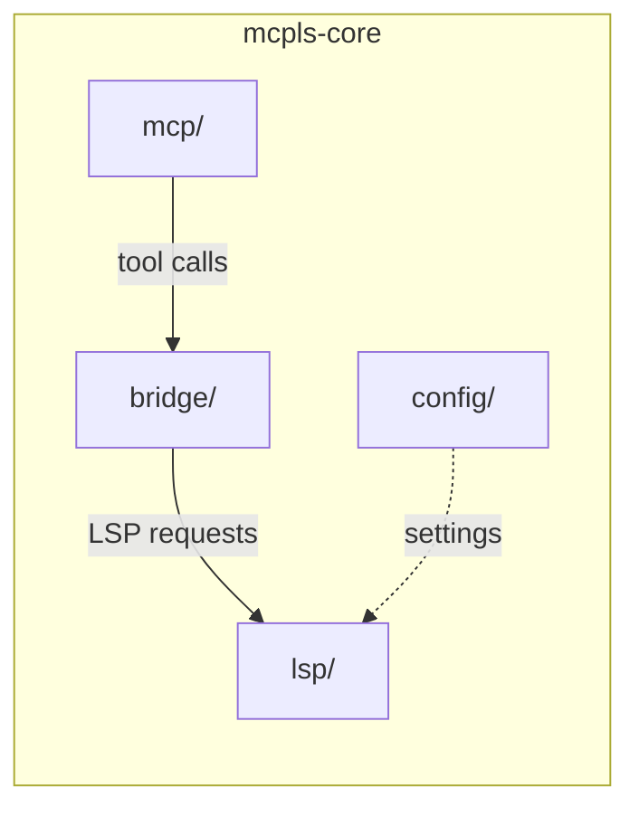

# mcpls-core

[](https://crates.io/crates/mcpls-core)
[](https://docs.rs/mcpls-core)
[](../../LICENSE-MIT)

**The translation layer that makes AI understand code semantically.**

mcpls-core bridges MCP and LSP protocols, transforming AI tool calls into language server requests and translating rich semantic responses back. It's the engine behind [mcpls](https://crates.io/crates/mcpls).

## What it does

- **Protocol translation** — Converts MCP tool calls to LSP requests and back
- **Position encoding** — Handles MCP's 1-based positions ↔ LSP's 0-based coordinates
- **LSP lifecycle** — Manages language server processes (spawn, initialize, shutdown)
- **Document tracking** — Lazy-loads files, maintains synchronization state
- **Configuration** — Parses TOML configs, discovers LSP servers

> [!NOTE]
> This is the library crate. For the CLI, see [`mcpls`](https://crates.io/crates/mcpls).

## Installation

```toml
[dependencies]
mcpls-core = "0.2"
```

## Architecture



| Module | Responsibility |
|--------|----------------|
| `mcp/` | MCP server implementation with rmcp, 13 tool handlers |
| `bridge/` | Position encoding, document state, request translation |
| `lsp/` | JSON-RPC 2.0 client, process management, protocol types |
| `config/` | TOML parsing, server discovery, workspace configuration |

## Usage

```rust
use mcpls_core::config::Config;
use mcpls_core::mcp::McplsServer;

#[tokio::main]
async fn main() -> anyhow::Result<()> {
    let config = Config::load()?;
    let server = McplsServer::new(config);
    server.run().await
}
```

## Design principles

- **Zero unsafe** — Memory safety enforced at compile time
- **Async-native** — Built on Tokio for concurrent LSP management
- **Error context** — Rich error types with `thiserror`, never panics
- **Resource limits** — Bounded document tracking, configurable timeouts

## License

Dual-licensed under [Apache 2.0](../../LICENSE-APACHE) or [MIT](../../LICENSE-MIT).
