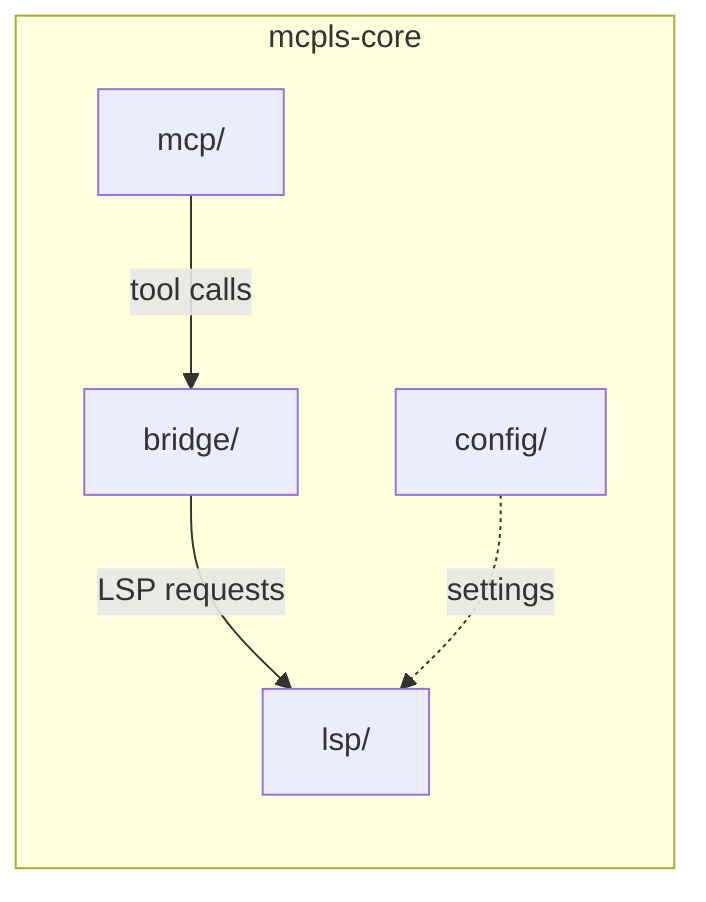

# mcpls-core

[](https://crates.io/crates/mcpls-core)
[](https://docs.rs/mcpls-core)
[](../../LICENSE-MIT)

**The translation layer that makes AI understand code semantically.**

mcpls-core bridges MCP and LSP protocols, transforming AI tool calls into language server requests and translating rich semantic responses back. It's the engine behind [mcpls](https://crates.io/crates/mcpls).

## What it does

- **Protocol translation** — Converts MCP tool calls to LSP requests and back
- **Position encoding** — Handles MCP's 1-based positions ↔ LSP's 0-based coordinates
- **LSP lifecycle** — Manages language server processes (spawn, initialize, shutdown)
- **Non-blocking startup** — MCP server accepts connections immediately; LSP initialization runs in the background
- **Document tracking** — Lazy-loads files, maintains synchronization state
- **Diagnostics cache** — Caches push-based `publishDiagnostics` notifications for fast polling via MCP
- **Configuration** — Parses TOML configs, discovers LSP servers, manages language extension mappings
- **Custom extension mapping** — Configurable file extension-to-language ID mappings with sensible defaults
- **Graceful degradation** — Continues with available servers, even if some fail to initialize

> [!NOTE]
> This is the library crate. For the CLI, see [`mcpls`](https://crates.io/crates/mcpls).

## Installation

```toml
[dependencies]
mcpls-core = "0.3.7"
```

## Architecture


```mermaid
flowchart LR
    subgraph mcpls-core
        M["mcp/"] -->|"tool calls"| B["bridge/"]
        B -->|"LSP requests"| L["lsp/"]
        C["config/"] -.->|"settings"| L
    end
```

| Module | Responsibility |
|--------|----------------|
| `mcp/` | MCP server implementation with rmcp, 16 tool handlers |
| `bridge/` | Position encoding, document state, notification cache, request translation |
| `lsp/` | JSON-RPC 2.0 client, process management, notification handling, protocol types |
| `config/` | TOML parsing, server discovery, workspace configuration |

## Usage

```rust
use mcpls_core::{ServerConfig, Transport};

#[tokio::main]
async fn main() -> anyhow::Result<()> {
    let config = ServerConfig::load()?;
    mcpls_core::serve_with(config, Transport::Stdio).await?;
    Ok(())
}
```

## Design principles

- **Zero unsafe** — Memory safety enforced at compile time
- **Async-native** — Built on Tokio for concurrent LSP management
- **Error context** — Rich error types with `thiserror`, never panics
- **Resource limits** — Bounded document tracking, configurable timeouts

## License

Dual-licensed under [Apache 2.0](../../LICENSE-APACHE) or [MIT](../../LICENSE-MIT).
