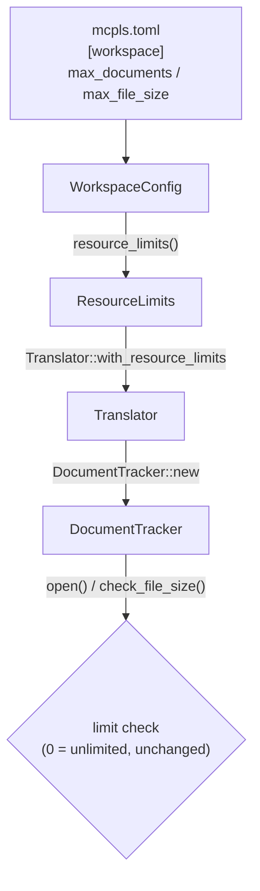

---
aliases:
  - Expose DocumentTracker Limits Plan
tags:
  - sdd
  - plan
  - bridge
  - config
created: 2026-08-05
status: implemented
related:
  - "[[spec]]"
  - "[[constitution]]"
---

# Technical Plan: Expose DocumentTracker Resource Limits

> [!info] References
> **Spec**: [[spec]]

> [!important] Resolution of Open Questions
> This plan resolves the spec's primary `[NEEDS CLARIFICATION]` (Section 9,
> spec.md) as follows, since a plan cannot proceed without picking a
> concrete surface. Rationale is given per decision; revisit if the user
> disagrees before implementation starts.
>
> 1. **Surface: TOML config only for v1** — flat fields on `[workspace]`
>    (`max_documents`, `max_file_size`), no new CLI flags or `MCPLS_*` env
>    vars. Rationale: mirrors the existing `workspace.heuristics_max_depth`
>    field, which is TOML-only with no CLI/env equivalent — the codebase's
>    established pattern for workspace-scoped tuning knobs (as opposed to
>    process-level knobs like `--log-level`/`MCPLS_LOG`, which *do* have CLI
>    flags because they apply before config is even loaded). Resource limits
>    are workspace-scoped, not process-bootstrap-scoped, so they follow the
>    TOML-only precedent. This also keeps the change minimal per the
>    project's simplicity/MVP conventions.
> 2. **Location: flat on `WorkspaceConfig`**, not a new `[workspace.limits]`
>    table. Rationale: consistent with `heuristics_max_depth` and
>    `position_encodings`, which are flat fields on the same struct; a
>    nested table would be the only nested table in `[workspace]` and adds
>    structure without a clear payoff for two fields.
> 3. **No new upper bound.** Rationale: unlike `request_timeout_seconds`
>    (bounded by `MAX_TIMEOUT_SECONDS` because an excessive timeout blocks a
>    request thread for real wall-clock time — a live liveness hazard),
>    `max_documents`/`max_file_size` bound *memory*, not time; there is no
>    equivalent hard external ceiling to mirror, and the existing `0 =
>    unlimited` sentinel already gives operators an explicit "I accept the
>    risk" opt-out. Adding an arbitrary upper bound would only reintroduce
>    exactly the problem this spec exists to fix. `usize`/`u64` typing
>    already excludes negative values; no additional validation is required
>    beyond what serde/TOML deserialization already enforces.
> 4. **README/config reference (FR-006) is required regardless**, added to
>    `docs/user-guide/configuration.md`'s existing `## Workspace Section`,
>    matching the format used for `workspace.position_encodings` and
>    `workspace.language_extensions`.

## 1. Architecture

### Approach

Add two new optional fields, `max_documents: usize` and `max_file_size: u64`,
directly to `WorkspaceConfig` (`crates/mcpls-core/src/config/mod.rs:62-88`),
each with a `#[serde(default = "...")]` pointing at a `const fn` returning
the current hardcoded default (100, `10 * 1024 * 1024`), following the exact
pattern already used for `heuristics_max_depth`
(`default_heuristics_max_depth`, mod.rs:86-88, 101-103).

Add a `WorkspaceConfig::resource_limits(&self) -> ResourceLimits` helper that
maps the two fields onto the existing `bridge::state::ResourceLimits` struct.
This keeps `ResourceLimits` itself (state.rs:135-150) unchanged — it remains
the bridge layer's internal representation; only how it gets *constructed*
changes.

Thread the resolved `ResourceLimits` from `ServerConfig`/`WorkspaceConfig`
through to every non-test `Translator` construction site that currently
calls `ResourceLimits::default()` (`translator.rs:141, 249, 3280, 3295,
4095` — the latter three are `#[cfg(test)]` and are explicitly left as
`ResourceLimits::default()` per FR-007's test-isolation carve-out; only
`Translator::new()` and `Translator::with_extensions()`, i.e. lines 141 and
249, are non-test production call sites and are the two that actually need
the config-sourced value). Since `Translator::new()` currently takes no
arguments and is called before config is available in some paths, the
simplest change that preserves existing call sites is to keep
`ResourceLimits::default()` as `Translator::new()`'s internal default and
add a `Translator::with_resource_limits(mut self, limits: ResourceLimits) ->
Self` builder method (mirroring the existing `with_extensions`/`with_router`
builder pattern), called from the same place in `lib.rs`/`serve()` that
currently calls `.with_extensions(...)`.

No changes to `DocumentTracker::open()`, `check_file_size()`, or the `0 =
unlimited` guard logic — those already do the right thing once a non-default
`ResourceLimits` reaches them.

### Component Diagram



### Key Design Decisions

| Decision | Choice | Rationale | Alternatives Considered |
|----------|--------|-----------|--------------------------|
| Config surface | TOML only, flat on `[workspace]` | Matches `heuristics_max_depth` precedent; workspace-scoped, not bootstrap-scoped | CLI flags/env vars (rejected: no precedent for workspace-scoped settings, adds surface area); nested `[workspace.limits]` table (rejected: only 2 fields, adds nesting without payoff) |
| Upper bound validation | None beyond type constraints | No liveness/wall-clock hazard analogous to `request_timeout_seconds`; `0` already gives an explicit unlimited opt-out | Mirror `MAX_TIMEOUT_SECONDS` pattern with a `MAX_DOCUMENTS`/`MAX_FILE_SIZE` ceiling (rejected: would recreate the exact problem being fixed) |
| Wiring mechanism | New `Translator::with_resource_limits` builder, called from `serve()` alongside `with_extensions` | Mirrors existing builder pattern (`with_router`, `with_extensions`, `with_notification_cache`); avoids threading limits through `Translator::new()`'s zero-arg signature, which several call sites (including tests) rely on | Change `Translator::new()` signature to take `ResourceLimits` (rejected: touches every construction site incl. ~30 test sites unnecessarily) |
| `DocumentLimitExceeded` message hint (FR-005) | Append a static hint referencing `workspace.max_documents` when the *default* value (100) is still in effect; omit the hint when a non-default value is configured (message already reflects the effective ceiling) | Avoids telling a user who already raised the limit to "go raise the limit" | Always show the hint (rejected: misleading once already configured) |

## 2. Project Structure

```
crates/mcpls-core/src/
├── config/
│   └── mod.rs              # WorkspaceConfig: + max_documents, max_file_size fields
│                            #   + default_max_documents(), default_max_file_size()
│                            #   + WorkspaceConfig::resource_limits()
├── bridge/
│   ├── state.rs             # ResourceLimits: unchanged struct; DocumentLimitExceeded
│                            #   message gains conditional hint (FR-005)
│   └── translator.rs        # Translator: + with_resource_limits() builder
│                            #   Translator::new()/with_extensions() unchanged
│                            #   (still ResourceLimits::default() as the pre-config default)
└── lib.rs                    # serve(): call .with_resource_limits(config.workspace.resource_limits())

docs/user-guide/
└── configuration.md          # + "### `workspace.max_documents`" and
                               #   "### `workspace.max_file_size`" under
                               #   "## Workspace Section"

README.md                     # optional: one-line mention + link to config reference
                               # (FR-006 is satisfied primarily via configuration.md;
                               # README already links there for all field docs)

CHANGELOG.md                  # [Unreleased] entry
```

## 3. Data Model

```rust
// crates/mcpls-core/src/config/mod.rs

/// Workspace-level configuration.
#[derive(Debug, Clone, Serialize, Deserialize)]
#[serde(deny_unknown_fields)]
pub struct WorkspaceConfig {
    // ...existing fields unchanged (roots, position_encodings,
    // language_extensions, heuristics_max_depth)...

    /// Maximum number of documents `DocumentTracker` will keep open
    /// simultaneously. A `textDocument/didOpen`-triggering tool call for a
    /// document beyond this count fails with `DocumentLimitExceeded` until
    /// an existing document is released. `0` disables the limit.
    /// Default: 100
    #[serde(default = "default_max_documents")]
    pub max_documents: usize,

    /// Maximum size, in bytes, of a single file `DocumentTracker` will
    /// open. A file larger than this fails with `FileSizeLimitExceeded`.
    /// `0` disables the limit.
    /// Default: 10485760 (10MB)
    #[serde(default = "default_max_file_size")]
    pub max_file_size: u64,
}

const fn default_max_documents() -> usize {
    100
}

const fn default_max_file_size() -> u64 {
    10 * 1024 * 1024
}

impl WorkspaceConfig {
    /// Maps the configured limits onto the bridge layer's `ResourceLimits`.
    #[must_use]
    pub fn resource_limits(&self) -> crate::bridge::state::ResourceLimits {
        crate::bridge::state::ResourceLimits {
            max_documents: self.max_documents,
            max_file_size: self.max_file_size,
        }
    }
}
```

`Default for WorkspaceConfig` (mod.rs:90-99) gains
`max_documents: default_max_documents()` and `max_file_size:
default_max_file_size()`, keeping `WorkspaceConfig::default()` in sync with
serde's per-field defaults (existing pattern for `heuristics_max_depth`).

`bridge::state::ResourceLimits` itself is **unchanged** — no new derive,
no new fields; it remains the internal runtime representation.

### Migrations

None — TOML fields with serde defaults are additive and backward compatible.
No schema/database migration involved.

## 4. API Design

Not applicable — no new MCP tools, HTTP endpoints, or JSON-RPC methods. This
is a config-plumbing change plus a documentation change. The only "API"
surface touched is:

| Surface | Change |
|---------|--------|
| `mcpls.toml` schema | + `workspace.max_documents` (optional, default 100) |
| `mcpls.toml` schema | + `workspace.max_file_size` (optional, default 10485760) |
| `Translator` builder API | + `with_resource_limits(self, ResourceLimits) -> Self` |
| `WorkspaceConfig` public API | + `resource_limits(&self) -> ResourceLimits` |
| `Error::DocumentLimitExceeded` message | conditional hint text (FR-005) |

## 5. Integration Points

| System | Direction | Protocol | Notes |
|--------|-----------|----------|-------|
| `mcpls.toml` config file | inbound | TOML (serde) | New optional fields, additive, `deny_unknown_fields` already enforced at `ServerConfig`/`WorkspaceConfig` level — typos in field names will already error out clearly |
| `crate::bridge::translator::Translator` | internal | Rust builder API | New `with_resource_limits` call inserted into the existing `serve()` construction chain |
| README / `docs/user-guide/configuration.md` | outbound | Markdown | Documentation-only addition, no runtime effect |

## 6. Security

- Authentication/authorization: not applicable — no new external-facing
  surface.
- Input validation: `usize`/`u64` deserialization via serde/TOML already
  rejects negative or non-numeric values with a clear parse error before
  `ServerConfig::validate()` even runs; no additional validation logic is
  added per the "no new upper bound" decision above.
- Sensitive data: none — these are plain numeric tuning knobs, not secrets.
- Resource-safety note: raising `max_documents`/`max_file_size` (or setting
  either to `0`/unlimited) is an explicit, documented operator opt-in to
  higher memory usage by `DocumentTracker` (each open document's full
  content is held in memory, per `DocumentState.content`, state.rs:109).
  The README addition (FR-006) must state this trade-off plainly so users
  raising the limit understand the memory cost.

## 7. Testing Strategy

| Level | Framework | What to Test | Coverage Target |
|-------|-----------|---------------|-------------------|
| Unit | `cargo nextest` | `WorkspaceConfig` TOML deserialization: default values when fields absent (mirrors `test_load_from_toml_without_request_timeout_seconds_defaults_to_thirty`, mod.rs:748); explicit non-default values parse correctly; `resource_limits()` maps fields 1:1 | New tests added, all pass |
| Unit | `cargo nextest` | `DocumentTracker::open()`/`check_file_size()` behavior unchanged for `ResourceLimits` built via `WorkspaceConfig::resource_limits()` with non-default values (e.g. `max_documents: 500` allows the 101st document; `max_documents: 0` never rejects) | Existing `state.rs` test patterns extended, not replaced |
| Unit | `cargo nextest` | `DocumentLimitExceeded` message includes the hint only when the effective `max_documents` equals the default (100), and omits it otherwise | New test |
| Integration | `cargo nextest` | `Translator::with_resource_limits` actually reaches the `DocumentTracker` used by tool dispatch — construct a `Translator`, open >100 documents with a raised limit, assert success | Extends existing translator integration tests |
| Regression | manual / CI live-test | Re-run the original 120-file reproduction from the finding: unchanged config still fails at #101 (SC-001); raised `max_documents = 200` config succeeds through #120 (SC-002) | Both scenarios verified before closing the issue |
| Docs | manual review | `docs/user-guide/configuration.md` renders correctly, follows the existing `### field.name` subsection format used for sibling fields | Reviewed in PR |

## 8. Performance Considerations

- Expected load: no change to hot-path performance — `open()`'s existing
  lock-acquire-and-check logic (state.rs:262-270) is untouched; only the
  *value* of `self.limits.max_documents` compared against changes based on
  config.
- Bottlenecks: raising `max_documents`/`max_file_size` substantially
  increases `DocumentTracker`'s steady-state memory footprint (each open
  document holds its full text content, per-server sync generations, and a
  path lock). This is an explicit, documented trade-off (see Section 6), not
  a bug — no mitigation beyond documentation is in scope for this spec (an
  eviction/LRU policy is explicitly out of scope per spec.md Section 1).
- Optimization plan: none needed; this change does not add any new
  per-request work.

## 9. Rollout Plan

Single PR, no feature flag needed:

1. Add `max_documents`/`max_file_size` fields to `WorkspaceConfig` with
   defaults matching current hardcoded values (fully backward compatible —
   SC-001 must still pass unchanged).
2. Add `WorkspaceConfig::resource_limits()` and `Translator::with_resource_limits`.
3. Wire `serve()` to call the new builder method.
4. Add the conditional `DocumentLimitExceeded` hint (FR-005).
5. Add/extend unit and integration tests (Section 7).
6. Update `docs/user-guide/configuration.md` (FR-006) and `CHANGELOG.md`.
7. Run full local check suite (`cargo +nightly fmt --check`, `cargo clippy
   --all-targets --all-features --workspace -- -D warnings`, `cargo nextest
   run --workspace --all-features --lib --bins`, rustdoc gate) before PR.
8. No migration needed for existing users — config files without these
   fields are unaffected.

## 10. Constitution Compliance

No `constitution.md` exists yet for this project (`.local/specs/constitution.md`
absent). Compliance is checked against `/Users/rabax/Dev/mcpls/.claude/CLAUDE.md`
project conventions instead:

| Principle | Status | Notes |
|-----------|--------|-------|
| `deny(unsafe_code)` workspace-wide | Compliant | No unsafe code introduced |
| Doc comments on all `pub` items | Compliant (planned) | New fields, `resource_limits()`, and `with_resource_limits()` all get `///` doc comments per Section 3/4 |
| Test with `cargo nextest`, mirror CI exactly | Compliant (planned) | Section 7 |
| Conventional Commits | Compliant (planned) | Implementation PR will use `feat(config): ...` |
| MVP / no premature abstraction | Compliant | No new table/nesting, no CLI/env surface added beyond what's needed; deliberately rejected a `[workspace.limits]` sub-table for exactly this reason |
| Before v1.0.0: no backward-compat baggage required | N/A | Change is additive/backward-compatible anyway — no breaking change needed |

## 11. Risks and Mitigations

| Risk | Impact | Probability | Mitigation |
|------|--------|--------------|-------------|
| Users raise `max_documents`/`max_file_size` without understanding the memory trade-off, causing OOM in constrained environments | medium | low | Document the trade-off explicitly (Section 6); no auto-cap added because that would just reproduce the original bug for legitimate large-workspace use cases |
| `with_resource_limits` builder is added but a call site is missed (e.g. a future new `Translator` construction path bypasses config) | medium | low | FR-007 explicitly enumerates all non-test call sites; grep for `ResourceLimits::default()` outside `#[cfg(test)]` blocks as a final PR-review check |
| Conditional `DocumentLimitExceeded` hint (FR-005) logic drifts out of sync if defaults change later | low | low | Compare against the same `default_max_documents()`/`default_max_file_size()` functions used for serde defaults, not a hardcoded literal, so both stay in sync by construction |
| Scope creep into CLI/env flags or per-server limits during implementation | low | medium | Plan explicitly scopes to TOML-only, global-only (Section "Resolution of Open Questions"); flag to user if implementer wants to expand scope |

## See Also

- [[spec]] — feature specification
- [[tasks]] — implementation tasks (after this phase)
- [[MOC-specs]] — all specifications
