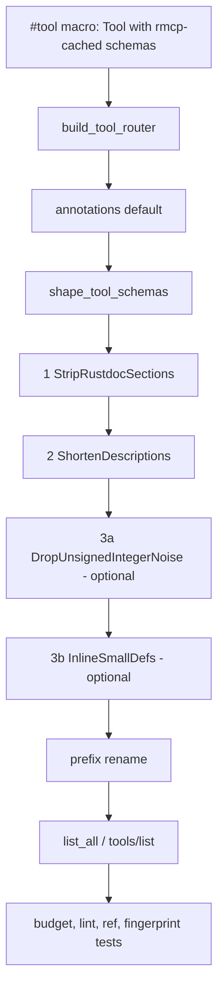

---
aliases:
  - tools/list payload size plan
tags:
  - sdd
  - plan
  - mcp
  - tools-list
  - schema
  - performance
created: 2026-10-05
status: draft
related:
  - "[[mcp/014-tools-list-payload-size/spec|spec]]"
  - "[[constitution]]"
---

# Technical Plan: Bounded `tools/list` Payload Size

> [!info] References
> **Spec**: [[mcp/014-tools-list-payload-size/spec|tools-list-payload-size]]
> **Baseline**: commit `517cb53`, 29 tools, 171,465 B compact
> **Status**: draft; blocked only on the spec's open `[NEEDS CLARIFICATION]` items for phase 3

## 1. Architecture

### Approach

Add one deterministic shaping pass over the assembled router, applied in
`McplsServer::build_tool_router` (`crates/mcpls-core/src/mcp/server.rs`), the single place that
already post-processes every `Tool` (annotation defaults and the optional name prefix). Every
consumer of the surface (`list_all()` in the golden snapshot, the prefixed-router test, the real
`tools/list` handler) therefore sees identical schemas (FR-016).

The schemas are produced by rmcp's `schema_for_type` / `schema_for_output`, which build their own
schema generator with the 2020-12 settings and cache the result per type in a thread-local. That
generator is not configurable from mcpls and the `#[tool]` macro offers no per-tool hook short of
`output_schema = <expr>` on all 29 tools. Shaping the finished `Tool` values is therefore the
narrowest intervention. `Tool::input_schema` is `Arc<JsonObject>` and `Tool::output_schema` is
`Option<Arc<JsonObject>>`; the pass takes ownership with `Arc::make_mut` so rmcp's cached `Arc`
is never mutated.

The pass is a small pipeline of `schemars::transform::Transform` implementations applied through
`RecursiveTransform`, which visits `properties`, `$defs`, `anyOf`/`oneOf`/`allOf` and `items`
(NFR-007: typed visitor over `schemars::Schema`, no text matching). Phases 1 and 2 touch only
`description`; phase 3 is optional and gated on clarification.



### Key Design Decisions

| Decision | Choice | Rationale | Alternatives Considered |
|----------|--------|-----------|------------------------|
| Where to shape | Post-generation pass in `build_tool_router` | One site, covers input and output schemas, no change to rmcp or to the 29 handlers | Per-tool `#[tool(output_schema = ...)]` (29 edits, input side unreachable); patch or fork rmcp (new maintenance burden); custom generator settings (rmcp does not accept them) |
| How to deduplicate repeated `$defs` | Shrink, do not share: shorten the description of any definition present in 2 or more tools; optionally inline small non-recursive ones | MCP tool schemas must be self-contained; a shared top-level block or cross-tool `$ref` breaks clients without a resolver (US-003, FR-008) | Shared `$defs` block in the list response (non-standard field, NFR-001); `$id`-based refs (external resolution); generator-level `inline_subschemas = true` (would inline everything, grow the payload, and cannot terminate on the recursive `Symbol`) |
| Description policy | Strip rustdoc sections and code fences, keep the first paragraph, cap at sentence end; explicit short `#[schemars(description = ...)]` on the handful of types where the first paragraph is not self-sufficient | The shaper is the safety net for future types; explicit overrides are reviewable and keep FR-010 statements in one canonical wording | Cap only (loses meaning where the opening sentence is a preamble); explicit overrides only (no protection against new `# Examples` leaking, FR-004) |
| Shared vs per-tool description length | Two caps: `SCHEMA_DESCRIPTION_CAP` (160 B) everywhere, `SHARED_DEF_DESCRIPTION_CAP` (a one-line form, about 70 B, or none) for definitions occurring in 2 or more tools | Measured on the golden snapshot: first-paragraph-only reaches about 145 KB, adding the shared-def rule reaches about 120 KB, largest tool about 7.9 KB | One cap (stops near 149 KB at 160 B, over budget) |
| Counting shared definitions | A first pass over all tools builds a name-to-copies map; a second pass shapes | Needs whole-router knowledge, which is why the entry point takes the full tool collection, not one tool | Hard-coded list of shared type names (rots when types change) |
| Budget constants | Named `usize` constants beside the test; total 130,000 B, per tool 9,000 B, schema description bytes 35,000 B | About 8% to 15% headroom over the measured 120 KB prototype; raising them is a reviewed diff (NFR-004) | Percentage-of-baseline budgets (drift with the baseline); per-tool table (noisy; kept as the fallback if one tool legitimately needs more) |
| Structural fingerprint | `$ref`-resolved projection of every schema (property names, `required`, `type`, enum and `const` values, composition keywords, nullability), stored in a committed fixture generated before the change | Makes FR-009 a mechanical check and keeps working after inlining changes where definitions live | Compare against the golden snapshot only (breaks the moment descriptions change, defeats the purpose) |

## 2. Project Structure

```
crates/mcpls-core/src/mcp/
├── schema_shape.rs        # new: Transform impls, shape_tool_schemas, budget constants for tests
├── server.rs              # build_tool_router calls shape_tool_schemas; tests regenerated
├── tool_surface.json      # golden snapshot, regenerated once, reviewed as a structural diff
└── tool_schema_shape.json # new: pre-change structural fingerprint (FR-015)
crates/mcpls-core/src/bridge/translator/
├── dto.rs, enclosing.rs   # explicit short schema descriptions on a few types (phase 2); rustdoc unchanged
docs/user-guide/tools-reference.md   # only if a dropped sentence is not covered elsewhere (NFR-008)
.local/testing/                      # regression note and process-notes entry (see section 9)
CHANGELOG.md                         # one line under [Unreleased]
```

`schema_shape` stays private to `mcp` (`mod schema_shape;` in `mcp/mod.rs`), consistent with the
existing private modules and the note in `mcp/mod.rs` about not widening the public surface.

## 3. Data Model

```rust
/// Closed set of shaping steps, applied in declaration order.
enum ShapeStep {
    StripRustdocSections,
    ShortenDescriptions { cap: DescriptionCap, shared_cap: DescriptionCap },
    DropUnsignedIntegerNoise,
    InlineSmallDefs { max_inlined_bytes: usize },
}

/// Byte ceiling for one description; never splits a UTF-8 sequence or a Markdown span.
struct DescriptionCap(usize);

/// Definition name to the number of tools whose input or output schema contains it.
struct DefUsage(BTreeMap<String, usize>);
```

`BTreeMap` keeps iteration deterministic (NFR-005). Steps are an enum, not a boxed trait list, so
the set is closed and exhaustively matched (project type-safety rule). Phase 3 variants are
compiled in but not in the default pipeline until the clarifications are resolved.

### Behaviour of each step

| Step | Rule | Spec |
|------|------|------|
| `StripRustdocSections` | In every `description`: cut at the first line that starts with `#` or with three backticks; trim trailing blank lines. Idempotent | FR-004 |
| `ShortenDescriptions` | Keep the first paragraph; if longer than the cap, cut at the last sentence end within it, else at the last whitespace; never leave an odd number of backticks or an open fence. Definitions with a `DefUsage` count of 2 or more use the shared cap | FR-003, FR-005, FR-010 |
| `DropUnsignedIntegerNoise` (optional) | On `type: integer` schemas drop `format` of `uint*`; keep or drop `minimum: 0` per the clarification | FR-009 |
| `InlineSmallDefs` (optional) | For a definition that is non-recursive and whose shaped size is at most `max_inlined_bytes`, replace each `{"$ref": "#/$defs/X"}` with the body (keeping any sibling `description`), then delete the definition once no `$ref` to it remains. Recursion is detected by a depth-first walk of `$ref` edges; `Symbol` is skipped | FR-006, FR-007 |

## 4. API Design

No MCP or Rust public API change. Internal surface:

| Item | Visibility | Description |
|------|-----------|-------------|
| `shape_tool_schemas(tools: &mut [Tool])` | `pub(super)` | Counts shared definitions, then applies the pipeline to every input and output schema |
| `McplsServer::build_tool_router` | existing | Calls `shape_tool_schemas` after the annotation default and before the prefix rename |
| Budget constants | `#[cfg(test)]` module items | `TOOLS_LIST_TOTAL_BUDGET_BYTES`, `TOOL_BUDGET_BYTES`, `SCHEMA_DESCRIPTION_BUDGET_BYTES` |

## 5. Integration Points

| System | Direction | Protocol | Notes |
|--------|-----------|----------|-------|
| rmcp `ToolRouter` / `Tool` | read and write | in-process | `route.attr.input_schema` and `output_schema` are replaced, `Arc::make_mut` avoids touching rmcp's thread-local cache |
| schemars `Transform` | use | in-process | Already a direct dependency (`schemars = "1.2"` with `chrono04`); no new dependency |
| Golden snapshot and prefix tests | consume | in-process | Both read `list_all()`; both pass unchanged in structure once the snapshot is regenerated |
| E2E `tools/list` and `structuredContent` validation | consume | stdio | Existing `test_e2e_tool_call_returns_structured_content_matching_output_schema` proves the shaped `outputSchema` still validates real results (NFR-001) |

## 6. Security

- No input handling changes; no new dependency; no `unsafe` (workspace `unsafe_code = "forbid"`).
- Shaping only removes annotation text from outbound metadata; it cannot add attacker-controlled content.
- Stripping must never remove a statement that warns a client that a result is untrusted (for example `positions_degraded: "request"`); FR-010 and the audit list in section 8 cover this.

## 7. Testing Strategy

| Level | Framework | What to Test | Coverage Target |
|-------|-----------|-------------|-----------------|
| Unit (transforms) | `cargo nextest`, `rstest` | Each step on synthetic schemas: rustdoc section removal, fence removal, first-paragraph cut at sentence end, no unterminated backtick span, multibyte text not split, `$ref` sibling description preserved, idempotence | Every step, every branch |
| Property | `proptest` (already a dev-dependency) | `shape(shape(s)) == shape(s)` and `len(shape(s)) <= len(s)` over generated descriptions and small schemas | Idempotence and monotonicity |
| Unit (budget, FR-012) | nextest | Serialize `build_tool_router(None).list_all()` compactly; assert total, per-tool and schema-description sums against the constants; on failure print a per-tool table with measured and permitted bytes | One test, whole surface |
| Unit (lint, FR-013) | nextest | Walk every schema `description`; fail on a fence, a heading line or a rustdoc section name, reporting tool, JSON path and offending line | One test |
| Unit (refs, FR-014) | nextest | Collect every `$ref`; assert `#/$defs/<Name>` form, resolves in the same document, no `$id`; with inlining enabled assert only recursive definitions remain referenced | One test |
| Unit (shape, FR-015) | nextest | Resolved structural projection equals `tool_schema_shape.json` for all 29 tools, input and output | One test plus an `#[ignore]` generator, same pattern as `dump_tool_surface` |
| Snapshot | existing | `test_tool_surface_matches_golden_snapshot` after one reviewed regeneration; `test_build_tool_router_with_prefix_renames_only_name` unchanged | Existing |
| E2E | existing `protocol_tests.rs` | `structuredContent` validates against the shaped `outputSchema`; add an informational print of the wire `tools/list` length, not a gate | Existing plus one print |
| Measurement helper (FR-018) | `#[ignore]` test | Print the per-tool and total byte table; used to record before and after figures in the PR | Manual |

The fingerprint fixture MUST be generated from the pre-change tree (first commit of the series),
so the later commits are compared against the original schemas.

## 8. Implementation Notes

### Semantic statements to preserve (FR-010 audit)

Before shortening, confirm each statement survives in one canonical place per tool:

| Statement | Today's home | Plan |
|-----------|-------------|------|
| `positions_degraded` `"request"` and `"response"` meanings | Tool descriptions (macro `positions_note_request!`) and the `PositionDegradation` definition (about 500 B, 25 copies) | Keep in tool descriptions; shared-def description becomes one line |
| `truncated: true` means more results exist | Tool descriptions of capped tools and result field docs | Keep in tool descriptions; field description one line |
| `out_of_workspace` meaning and its lexical, advisory nature (1,001 B, 5 tools) | Field doc only (not in tool descriptions) | Give the field an explicit short schema description stating the flag, that it is advisory and lexical, and that it is always `true` with no configured root; the long rationale stays in rustdoc and `tools-reference.md` |
| Enrichment `status` values and `fidelity` | Tool description macro `enclosing_symbol_note!` | Unchanged; type descriptions one line |
| `IndexingState` meaning (921 B, `restart_server`) | Definition doc | Explicit short description |
| `TypeHierarchyItemResult` description (817 B, rustdoc code) | Definition doc with `# Examples` | Stripped by step 1, then capped |

### Order of work

1. Generate and commit the structural fingerprint and the measurement helper from the unchanged tree.
2. Phase 1: `schema_shape.rs` with `StripRustdocSections`; wire into `build_tool_router`; regenerate the golden snapshot; add lint and `$ref` tests. Expected total about 166 KB (examples are about 5.9 KB of fenced text, so this phase alone is modest).
3. Phase 2: `ShortenDescriptions` with the shared-definition cap; explicit short descriptions for the audited types; add the budget test at 130,000 B. Expected total about 120 KB, largest tool about 7.9 KB.
4. Phase 3 (only if the spec's clarifications select it, or if phase 2 misses the budget): `DropUnsignedIntegerNoise`, then `InlineSmallDefs` for `Position2D`, `PositionDegradation` and `Range`, each kept only when the measured total does not grow (FR-006).

### Gotchas

- `$ref` can carry sibling keywords in 2020-12 (a property-level `description` next to `$ref`); inlining must merge the sibling description over the definition's.
- `schemars` may emit `$defs` entries named with a numeric suffix when two types collide; usage counting is by emitted name, which is the identity a client sees.
- The golden snapshot test compares parsed JSON values, so key order is irrelevant, but the snapshot must be regenerated through the existing `dump_tool_surface` helper rather than by hand.
- `tool_surface.json` is 259 KB pretty-printed and will shrink; a reviewer should diff it structurally (the fingerprint test is the mechanical backstop).
- Do not count the optional `title` of each `Tool` or `annotations` as shrinkable; they are small and part of the surface contract.

## 9. Rollout Plan

- Single PR, three commits matching the phases; `perf(mcp):` Conventional Commit type. The change is a metadata-only reduction with no tool, parameter or result change, so it is not marked breaking; descriptions that clients may display do change [NEEDS CLARIFICATION: whether a changed `description` string alone should be treated as breaking for the CHANGELOG]. Pre-v1 so no deprecation path.
- `CHANGELOG.md` `[Unreleased]`: one line, "`tools/list` payload reduced from about 171 KB to under 130 KB; schema descriptions no longer embed rustdoc examples", with the PR link.
- Update the testing documents under `.local/testing/` per the project rules (do not edit the continuous-improvement rule file): add a regression case "tools/list size under budget and no rustdoc code in schemas" to `regressions.md`, a measurement recipe to `process-notes.md`, and reset the `mcp` row in `coverage-status.md`.
- No feature flag; the shaping is deterministic and always on.

## 10. Constitution Compliance

| Principle | Status | Notes |
|-----------|--------|-------|
| I. Architecture (module boundaries) | Compliant | Change lives in `mcp/`; no `bridge` or `lsp` behaviour touched; only schema description attributes on DTOs in phase 2 |
| III. Testing | Compliant | Unit, property, snapshot and existing e2e coverage; every new item has a test |
| IV. Code style | Compliant | Closed enum of steps, newtype `DescriptionCap`, no stringly-typed rewriting, doc comments on all new items, no `unwrap` in non-test code |
| V. Security | Compliant | Metadata-only, no new input |
| VI. Performance | Compliant | Runs once at router construction (NFR-006); no extra LSP round trips |
| VII. Simplicity | Compliant | No new dependency; phase 3 is optional and measured before it is kept |
| VIII. Git workflow | Compliant | Conventional Commits, branch per `branching.md` once an issue number exists |

## 11. Risks and Mitigations

| Risk | Impact | Probability | Mitigation |
|------|--------|-------------|------------|
| A shortened description drops guidance an agent relied on | high | medium | FR-010 audit table; explicit short descriptions for audited types; one-canonical-statement rule; review of the regenerated snapshot |
| Inlining changes behaviour for a validator (siblings of `$ref`, recursion) | medium | low | Phase 3 optional; recursion check; resolved-structure fingerprint test; `structuredContent` e2e validation |
| Budget set too tight, blocking unrelated tool additions | medium | medium | Budgets leave 8% to 15% headroom over the prototype; raising a constant is an explicit, reviewable change; per-tool table as fallback |
| Budget set too loose, regressions creep in under it | low | medium | Stretch target of 110,000 B tracked as a follow-up; test prints the per-tool table so drift is visible |
| rmcp changes how it caches or generates schemas in a later release | low | low | The pass operates on the finished `Tool`, independent of how it was generated; the budget and lint tests catch any resulting change |
| In-process figure diverges from the wire figure | low | low | Informational e2e print; the original finding's 179,030 B vs 171,465 B gap is separator spacing only |

## See Also

- [[mcp/014-tools-list-payload-size/spec|spec]] — feature specification
- [[MOC-specs]] — all specifications
- [[mcp/001-mcp-tool-surface-and-routing/spec|mcp/001]] — golden snapshot and `min_level` flattening
- [[mcp/005-tool-capability-discoverability/plan|mcp/005 plan]] — earlier decision that kept `tools/list` shape stable
