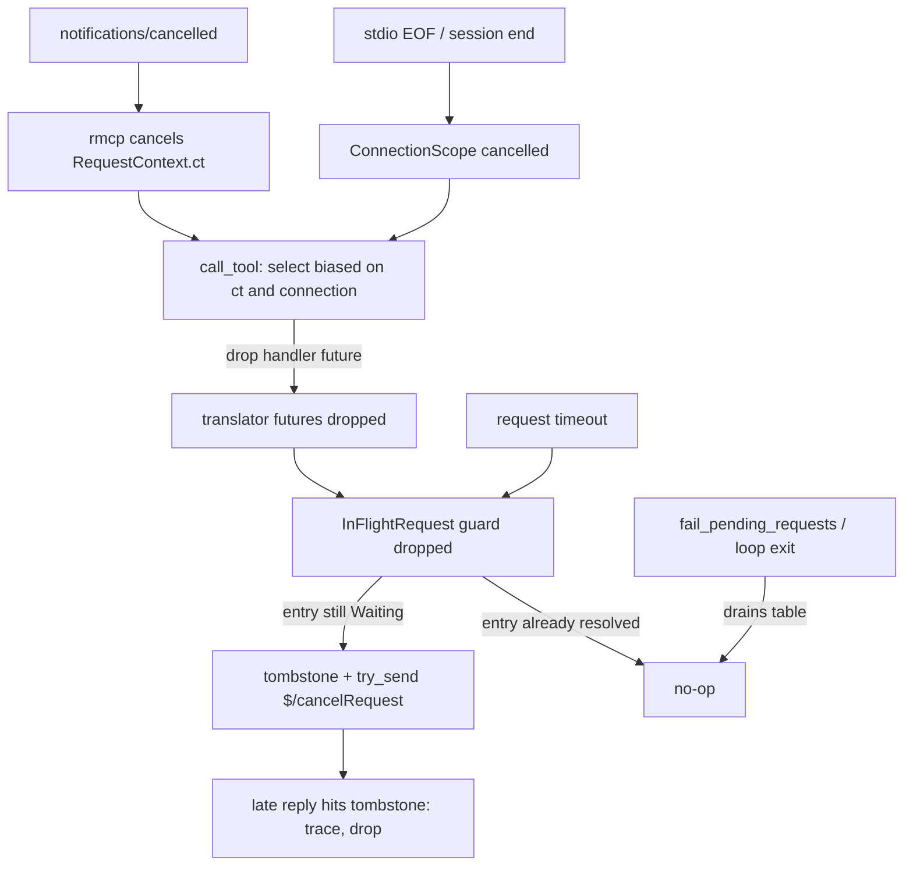

---
aliases:
  - Request cancellation propagation plan
tags:
  - sdd
  - plan
  - mcp
  - lsp
  - cancellation
  - resource-hygiene
created: 2026-10-06
status: draft
related:
  - "[[mcp/015-request-cancellation-propagation/spec|spec]]"
  - "[[constitution]]"
---

# Technical Plan: Request Cancellation Propagation (MCP to LSP)

> [!info] References
> **Spec**: [[mcp/015-request-cancellation-propagation/spec|request-cancellation-propagation]]
> **Baseline**: commit `12ee3a1`, `rmcp` 3.5.1, `tokio` 1.53.1, `gen-lsp-types` 0.11.0
> **Status**: draft; decisions below adopt the defaults stated in the spec's open questions

## 1. Architecture

### Approach

**Cancel by drop, with one observation point at the top and one guard at the bottom.** Instead of
threading a cancellation handle through about 30 request sites (and every `handle_*` signature),
the design uses Rust's drop semantics, the same way the rest of the code already relies on
`JoinSet` drops and `contain_panic`:

1. **Top (`mcp/`)**: `McplsServer::call_tool` races the whole handler future against the request
   token and the connection token. When either fires, the handler future is dropped. Everything
   it owns is dropped with it: backoff sleeps (FR-013), pending `JoinSet`s (their tasks are
   aborted, FR-020), sequential steps never reached (FR-017), indexing and settle waits (FR-030),
   locks and permits (FR-027). One site covers FR-001 to FR-004 for every tool, including future
   ones.
2. **Bottom (`lsp/`)**: every LSP request attempt owns a small guard (`InFlightRequest`) created
   when the request is registered. If the guard is dropped while the request is still outstanding
   (the caller was dropped, or the timeout branch abandons it), it atomically turns the pending
   entry into a tombstone and enqueues one `$/cancelRequest` with a non-blocking `try_send`
   (FR-005, FR-006, FR-010, FR-011). The same atomic step makes exactly-once structural
   (FR-008): the pending table is the single source of truth, and only a still-`Waiting` entry
   can be cancelled.
3. **Shared state (`bridge/`)**: the two sites that hold multi-step invariants across awaits get
   explicit cancel-safe structure instead of relying on drop: `DocumentTracker::ensure_open`
   (FR-026) reserves channel capacity first, then does send-and-record without an await, and
   `restart_server` (FR-025) gets an explicit policy.

A typed `CancelCause` (client cancel, connection closed, timeout) travels only where it is needed
for logging and for the guard; it is an enum, not a string (NFR-005).



### Why not thread a token through every call

| Option | Verdict |
|--------|---------|
| Add `&CancellationToken` to every `handle_*` and `LspClient::request*` (about 30 sites, plus `with_resolved_target` closures) | Rejected: wide signature churn, easy to forget at a new site (violates the DRY and "one mechanism" rule NFR-006), and still needs a guard to cover timeout and dropped futures |
| Task-local carrying the token, read inside `request_inner` | Rejected as primary: implicit, does not cross `tokio::spawn` (the `JoinSet` at `edits.rs`), and would add a polling `select!` in `request_inner` that the drop model makes unnecessary |
| **Drop-based cancel (chosen)** | One observation point, no signature change on the translator, covers timeout and abort uniformly, and keeps `LspClient::request` signatures stable |

The cost of drop-based cancel is that any await point is a possible stop point; that is acceptable
only because the few places with cross-await invariants are made cancel-safe explicitly
(section 3, "Cancel-safety audit").

### Key Design Decisions

| Decision | Choice | Rationale | Alternatives Considered |
|----------|--------|-----------|------------------------|
| Where handlers observe cancellation | `call_tool` races the handler with `ct` and the connection token (`biased`, cancel first) | One site for all 31 tools; rmcp does not abort the handler itself | Per-tool `select!` (31 edits); macro wrapper per tool |
| How `$/cancelRequest` is triggered | Drop guard on the request attempt | Covers client cancel, timeout, `JoinSet` abort, panic containment with one rule (FR-010) | Explicit cancel call at each site |
| Exactly-once | Pending table holds `Waiting(sender)` or `Cancelled` slots under one lock; only a `Waiting` slot can be turned into `Cancelled` and cancelled | Race-free by construction (FR-007, FR-008, FR-022); bulk drains remove slots so the guard then finds nothing (FR-021) | A separate `AtomicBool` per request (two sources of truth) |
| Pending lock type | Change `PendingRequests` from `tokio::sync::Mutex` to `std::sync::Mutex` | `Drop` is synchronous and cannot `lock().await`; every critical section is a short map operation with no await inside (to be verified at implementation; `drain_and_fail_pending` only sends on oneshots) | `try_lock` with spawn fallback (loses exactly-once); spawn a task per drop (needs a runtime handle at shutdown) |
| Late reply handling | `Cancelled` slot is a bounded tombstone: a reply removes it silently at `trace` | Keeps the unknown-id `warn!` meaningful for real protocol bugs (FR-014, SC-005) while quieting timeouts, which today warn | Downgrade the unknown-id warning for everyone |
| Tombstone bound | FIFO of at most `MAX_CANCELLED_TOMBSTONES` (named constant, initial 256), oldest evicted | A server that never replies cannot grow memory (NFR-002); an evicted tombstone only degrades to today's `warn!` | Unbounded set; TTL sweeper task (extra moving part) |
| Cancel enqueue | `command_tx.try_send(SendNotification { method, params })`; `Full` or `Closed` logs at `debug` and continues | Non-blocking from `Drop`, ordered after the request on the same FIFO channel (FR-009, FR-011, NFR-004) | `send().await` in a spawned task (ordering and shutdown races) |
| Cancel before the request is enqueued | Guard has two states: `Registered` (drop removes the entry only) and `Sent` (drop cancels); promoted after `command_tx.send` succeeds | A cancel must never precede its request on the wire (FR-009) | Always cancel (would send an id the server has not seen) |
| Cancel params type | A small `CancelParams { id: RequestId }` serialized with the existing untagged `RequestId`; method from `LspNotificationMethod::CancelRequest` | Our ids are `i64`; `lsp_types`' cancel params use a narrower integer, so reusing them could truncate (FR-031) | `lsp_types::CancelParams` (lossy conversion) |
| Shutdown and bulk failure | Guard checks the table: after `fail_pending_requests` or loop exit the slot is gone, so nothing is sent; `shutdown()` marks the client as closing before it issues `shutdown`, so late drops send nothing (FR-012, FR-021, FR-024) | Reuses the existing drain points; no new lifecycle state machine | Broadcast cancel on shutdown (burst, FR-024) |
| Connection close | `ConnectionScope` (a `CancellationToken` newtype) stored in `McplsServer`, cancelled when serving ends | rmcp cancels request tokens only on serve-loop cancel, not on EOF (verified at `QuitReason::Closed`) | Rely on rmcp (leaves handlers running); transport adapter detecting EOF earlier (more code; deferred, see risks) |
| `restart_server` | `RunToCompletion` policy once entered; checks the token at entry and before each server begins | FR-025: a half-restarted server is worse than a late stop | Cooperative drop (could abandon a respawn mid-way) |
| Policy typing | `enum CancelPolicy { Cooperative, RunToCompletion }` chosen per tool at registration, default `Cooperative` | Closed, exhaustively matched; a new tool is cancellable by default | Name list of exceptions in `call_tool` (stringly) |

## 2. Project Structure

```
crates/mcpls-core/src/
├── lsp/
│   ├── cancel.rs          # new: CancelCause, PendingTable/PendingSlot, InFlightRequest guard, CancelParams, MAX_CANCELLED_TOMBSTONES
│   ├── client.rs          # request_inner uses InFlightRequest; handle_inbound_message resolves slots; notify gains a reserved-permit form
│   └── mod.rs             # `mod cancel;` (pub items only where the bridge needs them)
├── bridge/
│   ├── state.rs           # ensure_open/sync_phase: reserve then send-and-record without an await (FR-026)
│   └── translator/
│       ├── routing.rs     # flush_pending_closes audit (FR-027)
│       ├── restart.rs     # per-server token check before restart_one (FR-025)
│       └── diagnostics.rs # confirm cancelled pull never reaches settle_pull (FR-029)
├── mcp/
│   ├── server.rs          # call_tool: select over ct and connection scope; CancelPolicy per tool; connection field on McplsServer
│   └── cancel.rs          # new: ConnectionScope, CancelPolicy, race_cancel helper (keeps server.rs from growing)
├── transport/
│   ├── stdio.rs           # cancel the ConnectionScope when serving ends
│   └── session_manager.rs # same for HTTP sessions (see task spike in section 9)
crates/mcpls-core/tests/e2e/
│   ├── cancel_tests.rs    # new: scripted fake language server, notifications/cancelled, EOF
│   └── fake_lsp.rs        # new fixture (or extend common/): records inbound messages, scripted delays; `.exe` on Windows
.local/testing/            # playbook, process-notes, coverage-status, regressions (testing documents, not the CI rule file)
docs/user-guide/           # one paragraph under the tools reference or troubleshooting page
CHANGELOG.md               # one line under [Unreleased]
```

`lsp/cancel.rs` has no dependency on `mcp/`; `mcp/cancel.rs` depends only on `tokio-util`
(NFR-006). `ConnectionScope` lives in `mcp/` because its owner is the transport-facing handler.

## 3. Data Model

```rust
/// Why a request was abandoned; closed set, used for logging and the guard.
enum CancelCause { Client, ConnectionClosed, Timeout }

/// One entry of the pending table; replaces the bare oneshot sender.
enum PendingSlot {
    /// A caller is awaiting the reply.
    Waiting(oneshot::Sender<Result<Value>>),
    /// We cancelled it; a late reply is expected and dropped quietly.
    Cancelled(CancelCause),
}

/// Pending table plus the FIFO that bounds tombstones; behind one std mutex.
struct PendingTable {
    slots: HashMap<RequestId, PendingSlot>,
    tombstones: VecDeque<RequestId>,
}

/// Lifetime of one request attempt; dropping it while outstanding cancels it.
struct InFlightRequest<'a> {
    client: &'a LspClient,
    id: RequestId,
    state: GuardState, // Registered | Sent | Resolved
}

enum GuardState { Registered, Sent, Resolved }

/// `$/cancelRequest` params; keeps the full width of `RequestId`.
#[derive(Serialize)]
struct CancelParams { id: RequestId }

/// Cancelled when the MCP connection ends for any reason.
struct ConnectionScope(CancellationToken);

enum CancelPolicy { Cooperative, RunToCompletion }
```

State machine of one slot, all transitions under the table lock:

| From | Event | To | Side effect |
|------|-------|----|-------------|
| absent | `register` | `Waiting` | none |
| `Waiting` | reply, `UndecodableResponse` | absent | complete the caller |
| `Waiting` | guard dropped in state `Sent` (cancel or timeout) | `Cancelled` | `try_send` one `$/cancelRequest`; push id on `tombstones`, evict oldest beyond the cap |
| `Waiting` | guard dropped in state `Registered` | absent | none (request never enqueued) |
| `Waiting` | bulk drain (`fail_pending_requests`, loop exit) | absent | fail the caller as today |
| `Cancelled` | reply | absent | `trace` log, drop |
| `Cancelled` | bulk drain or tombstone eviction | absent | none |
| absent | guard dropped | absent | none (reply already consumed or failed in bulk) |

The guard is marked `Resolved` when a reply was consumed, so a normal completion costs one state
write. A guard dropped in `Sent` whose slot is already absent is a no-op by the last row.

## 4. API Design

No MCP wire change: `tools/list` and `tool_surface.json` are untouched (NFR-001).

| Item | Visibility | Description |
|------|-----------|-------------|
| `LspClient::request`, `request_typed`, `request_typed_classified` | unchanged signatures | Gain cancel-on-drop internally; no new parameter |
| `LspClient::reserve_notifications(n)` | `pub(crate)` | Awaits `command_tx.reserve_many(n)`; cancel-safe because nothing is sent until the permits are used |
| `NotificationPermits::send_typed::<N>(params)` | `pub(crate)` | Synchronous, infallible send on a reserved slot |
| `McplsServer::call_tool` | existing | Races handler with `ct` and `ConnectionScope`; maps the outcome to a never-delivered `McpError` |
| `ConnectionScope::{new, token, cancel_on_drop}` | `pub(crate)` | Created per `McplsServer` (including `for_new_session`), cancelled by the transport runner |
| `CancelPolicy` | `pub(crate)` | Per-tool, default `Cooperative`; `restart_server` is `RunToCompletion` |
| Public API change | breaking-free | If the reserved-permit form is exposed on `pub` `notify*`, record it in `CHANGELOG.md` (NFR-010); the plan keeps it `pub(crate)` |

`call_tool` contract: return `Err(McpError::internal_error("request cancelled", None))` on
cancellation. rmcp drops the result (response is discarded for a cancelled id, or the transport is
closed), so the value is never observed; it is logged at `debug` (FR-004), not at `warn!` from the
`response error` path in rmcp, whose log line we cannot suppress and is accepted.

## 5. Integration Points

| System | Direction | Protocol | Notes |
|--------|-----------|----------|-------|
| rmcp serve loop | read | in-process | `RequestContext::ct` is a child of the serve-loop token: cancelled by `notifications/cancelled` and by serve-loop cancel; not cancelled at EOF |
| Language server | outbound | LSP notification `$/cancelRequest` | Base protocol; no capability gate (NFR-007); a late `-32800` or result is dropped by the tombstone |
| `ensure_open` and document tracker | internal | in-process | Reserve-then-record restructure (below) |
| `fail_pending_requests`, `respawn`, loop-exit drain | internal | in-process | Operate on the new `PendingTable`; remove slots of both kinds |
| Diagnostics pump and `settle_pull` | internal | in-process | A pull future dropped before `settle_pull` stores nothing (FR-029); `-32800` after our cancel never reaches it because the caller is gone |
| Transport runners (`stdio.rs`, `session_manager.rs`) | internal | in-process | Cancel the `ConnectionScope` after `waiting()` returns, with a drop guard so a dropped runner also cancels |

### Cancel-safety audit (FR-026, FR-027)

| Site | Hazard under drop at an await | Resolution |
|------|-------------------------------|-----------|
| `DocumentTracker::ensure_open` / `sync_phase` | `didOpen` or `didChange` enqueued, then future dropped before the synced version is recorded; next call sends `didOpen` again. Also `take_pending_close` followed by a dropped `didClose` notify skips `restore_pending_close` | Acquire channel permits first (`reserve_many`, cancel-safe), then take the pending-close, send via permits, and record the version with no await in between. A drop before the permits are used sends nothing and records nothing |
| `flush_pending_closes` (claim held across `notify_typed().await`) | Drop mid-way releases the claim; whether the unsent close stays owed depends on when the debt is cleared | Audit the claim API; if debt is cleared at claim time, move the clearing after a successful permit-send; add a test that drops at each await |
| `resolve_deferred_code_actions` (`JoinSet`) | Dropped `JoinSet` aborts tasks mid-request | Intended: each task's request guard cancels its id (FR-020) |
| `restart_servers` (`buffer_unordered`) | Dropped stream abandons a respawn mid-way | `RunToCompletion` policy; per-server token check only before a server begins (FR-025) |
| `with_resolved_target` (documentSymbol then main request) | Drop between steps | Safe: no shared state mutated between the steps |
| `enclosing_symbol` enrichment | Per-file requests dropped | Safe: results are local to the call |
| Indexing gate and settle waits | Waiter registrations | Verify they are RAII (permit/notify handles); fix any manual registration without a guard (FR-027) |

## 6. Security

- No new input surface: a cancel only removes work. `$/cancelRequest` carries a numeric id mcpls allocated itself, never client-supplied data.
- The tombstone bound prevents a hostile or buggy server from growing memory by never replying (NFR-002); a server that floods unknown ids still hits the existing unknown-id path.
- No new dependency, no config key, no env var (so no new untrusted-workspace interaction; see the project rule that untrusted mode is CLI-only). `unsafe_code = "forbid"` holds.
- A cancel never converts into an error body containing server text; the cancelled call produces no client-visible output (FR-003).

## 7. Testing Strategy

| Level | Framework | What to Test | Coverage Target |
|-------|-----------|-------------|-----------------|
| Unit: pending table | `cargo nextest`, `rstest` | Every row of the slot state machine; tombstone eviction at the cap; reply to a tombstone logs at `trace` only; duplicate guard drops cancel once | All transitions |
| Unit: `LspClient` over the command channel | nextest, `#[tokio::test(start_paused = true)]` | Existing pattern (`mpsc::channel::<ClientCommand>` receiver as the "server"): drop mid-request sends exactly one `$/cancelRequest` with the right typed id; timeout sends one then `Error::Timeout`; cancel during backoff allocates no new id; cancel before enqueue sends nothing; full queue skips with no error; bulk drain then drop sends nothing; `-32800` after our cancel does not retry or log above `trace` | FR-005 to FR-016, FR-021, FR-022 |
| Property | `proptest` (dev-dependency exists) | Random interleavings of {reply, timeout, drop, bulk drain} over one request: at most one cancel, never a cancel after a reply or drain, final slot state absent or bounded tombstone | FR-008 |
| Unit: cancel-safety | nextest | Drive `ensure_open` and `flush_pending_closes` with a drop injected after each await point (a poll-until-n harness): tracker state equals what the recording client received, no duplicate `didOpen`, claim released | SC-008 |
| Unit: connection scope and policy | nextest | `race_cancel` returns the cancel outcome without polling the handler when already cancelled (FR-002); `RunToCompletion` ignores mid-flight cancel but honors entry check | FR-001, FR-002, FR-025 |
| E2E | `tests/e2e` with the existing in-process MCP client and a scripted fake language server | `get_references` slow server then `notifications/cancelled`: server log shows request then exactly one `$/cancelRequest` same id, no response reaches the client, next call succeeds; cancel during `-32802` backoff; timeout path (shortened timeout via config) sends one cancel and the late reply produces no warn; two-server fan-out (`restart_server`) cancel skips unstarted servers; stdio EOF with a call in flight stops the handler and cancels the request | US-001 to US-005, SC-001 to SC-010 |
| Snapshot | existing | `tool_surface.json` golden unchanged (NFR-001) | Existing |
| Live | `.local/testing/playbooks/` | With a real language server: cancel a large `get_references`, observe the server's request log or CPU; time out a request with a tiny `request_timeout` and confirm one cancel and no warn on the late reply | Manual, per CI cycle |

Fixture note: the fake language server is a Rust test binary or an in-process duplex endpoint; any
spawned executable follows the Windows `.exe` rule. Timing is driven by paused tokio time or
explicit barriers, never by sleeps near CI jitter (NFR-008).

## 8. Performance Considerations

- Uncancelled path: one extra struct per request, one state write on resolve, and a `std::sync::Mutex` lock in place of a `tokio::sync::Mutex` lock on the same short sections; no extra messages, no extra LSP round trips (constitution VI: `$/cancelRequest` is a notification and is sent only on cancel or timeout).
- Cancelled path: O(1) per outstanding id; `try_send` never awaits.
- Bound: at most `MAX_CANCELLED_TOMBSTONES` ids retained per client.
- `call_tool` adds one `select!` over two cancellation futures per call (token waits are allocation-free after creation).
- Expected net effect on busy servers: positive, because abandoned work stops.

## 9. Rollout Plan

- One PR, commits in this order, each green on its own:
  1. `refactor(lsp)`: `PendingTable` and `PendingSlot` replace the bare map, std mutex, tombstone-free behavior identical (all existing tests pass unchanged).
  2. `feat(lsp)`: `InFlightRequest` guard, `$/cancelRequest`, tombstones, timeout cancel, retry-abort by drop, reply quieting.
  3. `fix(bridge)`: cancel-safe `ensure_open` and pending-close flush (permits).
  4. `feat(mcp)`: `ConnectionScope`, `CancelPolicy`, `call_tool` race, `restart_server` policy and per-server check, transport wiring.
  5. `test` and `docs`: e2e fixture and tests, user-guide paragraph, `.local/testing/` playbook, coverage-status reset, regression entries, `CHANGELOG.md`.
- Spike inside commit 4: locate where HTTP sessions end (`CappedSessionManager::close_session`, rmcp session worker) and whether session end cancels the serve-loop token (then request tokens are already cancelled, as in the `Cancelled` branch) or only closes the transport (then the session's `ConnectionScope` must be cancelled there). Outcome recorded in the PR.
- `CHANGELOG.md` `[Unreleased]`: one line, "Client-cancelled MCP calls and timed-out LSP requests now send `$/cancelRequest` to the language server and stop retrying", with the PR link.
- No feature flag and no config key (spec out of scope); the behavior is protocol-mandated hygiene. Pre-v1: any signature change is recorded without a deprecation path.
- Priority P3; labels per `commits-and-issues.md` (`enhancement`, `P3`) when the issue is filed; branch `feat/{slug}` or `fix/` form per `branching.md` once an issue number exists.

## 10. Constitution Compliance

| Principle | Status | Notes |
|-----------|--------|-------|
| I. Architecture (module boundaries, graceful degradation) | Compliant | `lsp/` stays independent of `mcp/`; one server's cancel or failure does not affect others (FR-019) |
| II. Technology stack | Compliant | No new dependency; `tokio-util` token and `tokio` `reserve_many` already available |
| III. Testing | Compliant | Unit, property, e2e and live playbook; cancel-safety tests drop at every await |
| IV. Code style | Compliant | Typed `RequestId`, enums for cause, slot, guard state and policy; no `unwrap` in production code; doc comments with contracts on new items; no string matching on error text (FR-016) |
| V. Security | Compliant | Bounded tombstones, no client-supplied ids on the wire, no new surface |
| VI. Performance | Compliant | No added LSP round trips; O(1) overhead |
| VII. Simplicity | Compliant | One mechanism (drop), one observation point; no per-site plumbing; no flags |
| VIII. Git workflow | Compliant | Conventional Commits per commit list above |

## 11. Risks and Mitigations

| Risk | Impact | Probability | Mitigation |
|------|--------|-------------|------------|
| A drop at an unaudited await point desynchronizes shared state | high | medium | Section 5 audit table; exhaustive drop-at-each-await tests for `ensure_open` and the close flush; grep for other `Mutex`/permit holders across awaits during commit 3 |
| `std::sync::Mutex` on the pending table blocks the runtime if held across an await | medium | low | Critical sections are map operations only; clippy `await_holding_lock` is already denied under `-D warnings`; verify `drain_and_fail_pending` and the message loop |
| Tombstone eviction under a cancel storm returns the old unknown-id `warn!` | low | low | Cap sized for the 100-slot command channel with headroom; the downgrade is only a log line |
| `try_send` fails on a full command queue so the server is not told | low | low | Documented best-effort (FR-011); the late reply is still handled; revisit with a bounded `send_timeout` fallback only if live testing shows lost cancels |
| Handlers outlive EOF by up to the rmcp drain window (5 s) because the connection scope is cancelled after `waiting()` returns | low | medium | Accepted by NFR-003 and SC-009; a transport adapter that cancels at EOF is the follow-up if needed |
| HTTP session end does not reach the per-session scope | medium | medium | Spike in commit 4 with a test; fallback to the serve-loop token path if it already cancels request tokens |
| rmcp logs a `response error` warning for the cancelled call's returned `Err` | low | high | Accepted; the error is never sent; note in the playbook so live testers do not file it |
| Servers that treat `$/cancelRequest` for a finished request as an error | low | low | The base protocol requires servers to ignore unknown ids; exactly-once and the `Waiting` check already avoid sending for finished ids |
| A future tool needs run-to-completion semantics and forgets the policy | medium | low | Default `Cooperative` is the safe default for read-only tools; a registration test lists every non-default policy so adding one is a reviewed change |
| Scripted fake-server fixture is flaky on Windows | medium | medium | Prefer in-process duplex endpoints for most scenarios; spawn a real executable only for EOF and child-lifetime paths |

## See Also

- [[mcp/015-request-cancellation-propagation/spec|spec]] — feature specification
- [[MOC-specs]] — all specifications
- [[lsp/005-lsp-content-modified-retry/spec|lsp/005]] — retry loop interrupted by cancellation
- [[lsp/001-lsp-server-lifecycle-and-respawn/spec|lsp/001]] — bulk pending failure on respawn
- [[mcp/008-manual-lsp-server-restart/spec|mcp/008]] — restart fan-out and generation handling
- [[bridge/002-document-tracker-synchronization/spec|bridge/002]] — `ensure_open` serialization
